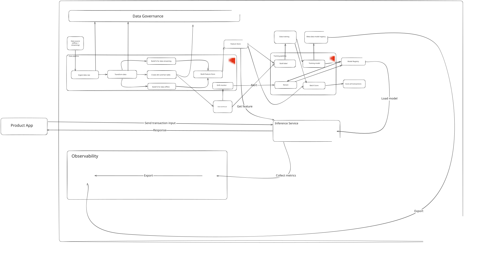

# Fraud Detection — End-to-End Data & AI Platform

Real-time fraud scoring system on Kubernetes, covering the full ML lifecycle: data ingestion, feature engineering, model training, online inference, drift monitoring, and CI/CD.

| | |
|---|---|
| **Domain** | Finance — credit card fraud detection |
| **Stack** | Airflow · PostgreSQL · MinIO · XGBoost · KServe · Prometheus · Grafana · DataHub · Jenkins |
| **Model** | XGBoost · PR-AUC = 0.8148 · 271 tests |
| **Author** | anjuly26th@gmail.com |

---

## Table of Contents

- [Architecture](#architecture)
- [Repository Layout](#repository-layout)
- [Prerequisites](#prerequisites)
- [Quick Start](#quick-start)
- [Running Tests](#running-tests)
- [CI/CD](#cicd)
- [Rollback](#rollback)
- [Design Documents](#design-documents)

---

## Architecture

<!-- The system follows a **medallion architecture** (Bronze → Silver → Gold) feeding into an ML pipeline. All components run inside a single Kind cluster. -->

---

## Repository Layout

```
.
├── config/
│   ├── generate_config.yaml     # Data generator parameters
│   └── pipeline_config.yaml     # DB, MinIO, pipeline settings
│
├── dags/                        # Airflow DAG definitions (12 DAGs)
│   ├── dag_bronze_ingest.py
│   ├── dag_silver_transform.py
│   ├── dag_gold_model.py
│   ├── dag_feat_customer_90d.py
│   ├── dag_feat_stream_30m.py
│   ├── dag_feat_unified.py
│   ├── dag_feat_backfill.py
│   ├── dag_ml_label.py
│   ├── dag_ml_train.py
│   ├── dag_ml_batch_score.py
│   ├── dag_drift_monitor.py
│   └── dag_ml_retrain_trigger.py
│
├── design/                      # Design documents
│
├── docs/
│   ├── assets/                  # Screenshots, diagrams
│   ├── airflow-setup.md
│   ├── datahub-setup.md
│   ├── jenkins-setup.md
│   ├── kserve-setup.md
│   └── monitoring-setup.md
│
├── infra/
│   ├── docker/                  # Dockerfiles (airflow, inference, jenkins)
│   ├── helm/                    # Helm values (airflow, datahub, monitoring)
│   └── k8s/                     # K8s manifests (ISVC, RBAC, secrets)
│
├── jenkins/
│   ├── Jenkinsfile.track_a      # Data / ML pipelines CI+CD
│   ├── Jenkinsfile.track_b      # Inference service CI+CD
│   └── Jenkinsfile.track_c      # IaC (Helm + K8s)
│
├── scripts/
│   ├── setup/                   # One-time cluster setup
│   │   ├── init_gold_schema.py
│   │   ├── upload_raw_to_minio.py
│   │   └── reset_pipeline.py
│   └── validate/                # Verification & smoke tests
│       ├── sample_output.sql
│       ├── test_inference.py
│       ├── test_monitoring.py
│       ├── generate_drift_report.py
│       └── emit_lineage.py
│
├── src/
│   ├── generator/               # Synthetic data generator
│   ├── inference/               # FastAPI inference server
│   └── pipelines/               # Pipeline implementations
│       ├── bronze/
│       ├── silver/
│       ├── gold/
│       ├── features/
│       └── ml/
│
├── tests/
│   ├── unit/                    # 183 unit tests
│   └── integration/             # 88 integration tests
│
├── data/
│   └── raw/                     # Generated data (gitignored)
│
└── pytest.ini
```

---

## Prerequisites

| Tool | Version | Notes |
|---|---|---|
| Docker | 24+ | Container runtime |
| kind | 0.20+ | Local Kubernetes cluster |
| kubectl | 1.29+ | Cluster management |
| helm | 3.x | Chart deployments |
| Python | 3.11+ | Pipeline + inference code |
| uv | latest | Fast Python package manager |
| ngrok | latest | Jenkins webhook exposure |

---

## Quick Start

### 1 — Create cluster

```bash
kind create cluster --name fraud-detection
kubectl cluster-info --context kind-fraud-detection
```

### 2 — Deploy infrastructure

Install components in order (each `docs/*-setup.md` covers Helm install, port-forward, and smoke test):

```bash
# PostgreSQL + MinIO + Airflow
# docs/airflow-setup.md → namespaces: fraud-infra, airflow

# Prometheus + Grafana
# docs/monitoring-setup.md → namespace: monitoring

# KServe + Knative + Istio
# docs/kserve-setup.md → namespace: fraud-infra

# DataHub
# docs/datahub-setup.md → namespace: datahub

# Jenkins CI/CD
# docs/jenkins-setup.md → namespace: jenkins
```

### 3 — Generate data

```bash
python src/generator/generate_data.py --config config/generate_config.yaml
```

Produces `data/raw/offline/` (Parquet) and `data/raw/streaming/fraud_events.json`:
- 120,000 customers · 1,440,000 transactions · 180 days
- 10% fraud rate · drift scenario starting 2025-08-01

### 4 — Initialize storage

```bash
# Port-forward MinIO and PostgreSQL
kubectl port-forward svc/fraud-minio -n fraud-infra 9000:9000 &
kubectl port-forward svc/fraud-postgres-postgresql -n fraud-infra 15432:5432 &

# Upload raw files to MinIO, create Gold schema in PostgreSQL
uv run scripts/setup/upload_raw_to_minio.py
uv run scripts/setup/init_gold_schema.py
```

### 5 — Run data pipelines

```bash
kubectl port-forward svc/airflow-api-server 8080:8080 -n airflow
# Airflow UI → http://localhost:8080  (admin / admin)
```

Trigger DAGs in order:

| DAG | Schedule | Output |
|---|---|---|
| `dag_bronze_ingest` | `@daily` | `raw_*` Delta tables |
| `dag_silver_transform` | `@daily` | `stg_*` Delta tables |
| `dag_gold_model` | `@daily` | `dim_*`, `fact_*`, `obt_*` in PostgreSQL |
| `dag_feat_customer_90d` | `@hourly` | 90-day batch features |
| `dag_feat_stream_30m` | every 30min | Streaming features |
| `dag_feat_unified` | every 15min | Merged feature point for inference |
| `dag_ml_label` | `@daily` | `ml_fraud_label`, `ml_fraud_training` |
| `dag_ml_train` | weekly | XGBoost model in `ml_model_registry` |
| `dag_ml_batch_score` | daily 05:00 | `ml_fraud_scores` |
| `dag_drift_monitor` | `@daily` | PSI reports + alerts |
| `dag_ml_retrain_trigger` | daily 07:00 | Auto-retrain on drift |

### 6 — Test inference

```bash
kubectl port-forward -n fraud-infra \
  $(kubectl get pod -n fraud-infra -l serving.knative.dev/service=fraud-predictor -o name | head -1) \
  8080:8080

python scripts/validate/test_inference.py --host localhost --port 8080
```

---

## Running Tests

```bash
pip install -r requirements.txt

# Full suite (271 tests)
pytest tests/ -v --tb=short

# Unit only
pytest tests/unit/ -v

# Integration only
pytest tests/integration/ -v --tb=short
```

Verify Gold table row counts after pipelines complete:

```bash
kubectl port-forward svc/fraud-postgres-postgresql -n fraud-infra 15432:5432 &
PGPASSWORD=fraud_pass psql -h localhost -p 15432 -U fraud_user -d fraud_detection \
  -f scripts/validate/sample_output.sql
```

| Table | Expected rows |
|---|---|
| `gold_fraud.fact_transaction` | ~1,440,000 |
| `gold_fraud.ml_fraud_training` | ~1,440,000 |
| `gold_fraud.ml_model_registry` | ≥ 1 (PR-AUC = 0.8148) |
| `gold_fraud.ml_fraud_scores` | ~1,440,000 |
| `gold_fraud.feature_drift_alerts` | 6 (Aug 26 – Sep 30) |

---

## CI/CD

Three Multibranch Jenkins pipelines with changeset detection. Each pipeline runs CI (lint + tests) on all branches and CD only on `main`.

| Pipeline | Jenkinsfile | Triggers on |
|---|---|---|
| `fraud-track-a` | `jenkins/Jenkinsfile.track_a` | `src/pipelines/**` · `dags/**` · `config/**` · `infra/helm/airflow/**` |
| `fraud-track-b` | `jenkins/Jenkinsfile.track_b` | `src/inference/**` · `infra/docker/inference/**` · `infra/k8s/fraud-inference.yaml` |
| `fraud-track-c` | `jenkins/Jenkinsfile.track_c` | `infra/helm/**` · `infra/k8s/**` |

Manual full deploy: trigger on `main` with no code change, or use the `FORCE_DEPLOY` parameter.

Agent image: `ancaotrinh/jenkins:latest` (kubectl + Helm + Docker CLI + Python 3) with DinD sidecar.

Setup guide: `docs/jenkins-setup.md`

---

## Rollback

| Component | Command |
|---|---|
| Airflow | `helm rollback airflow 0 -n airflow` |
| Prometheus stack | `helm rollback kube-prom 0 -n monitoring` |
| DataHub | `helm rollback datahub 0 -n datahub` |
| Inference model | `kubectl patch inferenceservice fraud -n fraud-infra --type=json -p='[{"op":"replace","path":"/spec/predictor/containers/0/image","value":"ancaotrinh/fraud-inference:<prev-sha>"}]'` |

---

## Data Model

Gold schema (PostgreSQL `gold_fraud`) — dimensions, facts, feature store, and ML tables:


---

## Design Documents

| Section | File |
|---|---|
| 01 — Data Generator | `design/01_data_generator.md` |
| 02 — Schema Design | `design/02_schema_design.md` |
| 03 — Drift Simulation | `design/03_data_generator_improvement.md` |
| 04.1 — ML Design | `design/04.1_ml_design.md` |
