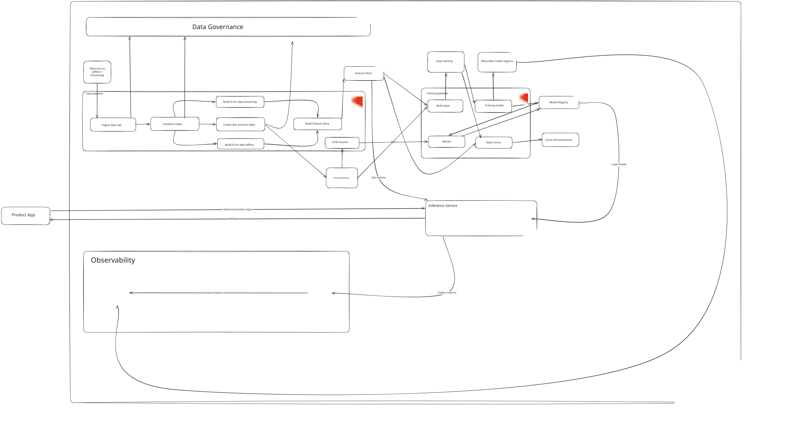

# Fraud Detection — End-to-End Data & AI System

Real-time fraud scoring system built on Kubernetes (Kind), covering data generation, feature engineering, ML training, online inference, CI/CD, and monitoring.

| Domain | Finance — credit card fraud detection |
|---|---|
| Sections completed | 01 Data Generator · 02 Schema Design · 03 Drift Simulation · 04.1 ML Design |
| AI track | ML (XGBoost, PR-AUC = 0.8148) |
<!-- | Author | ancaotrinh@gmail.com | -->

---

## Table of Contents

- [Architecture Overview](#architecture-overview)
- [Prerequisites](#prerequisites)
- [Quick Start](#quick-start)
  - [Step 1 — Create Kubernetes Cluster](#step-1--create-kubernetes-cluster)
  - [Step 2 — Deploy Core Infrastructure](#step-2--deploy-core-infrastructure)
  - [Step 3 — Generate Data](#step-3--generate-data)
  - [Step 4 — Upload Raw Data & Init Gold Schema](#step-4--upload-raw-data--init-gold-schema)
  - [Step 5 — Run Data Pipelines via Airflow](#step-5--run-data-pipelines-via-airflow)
  - [Step 6 — Quick test](#step-6--quick-test)
  - [Step 7 — Run Tests](#step-7--run-tests)
  - [Step 8 — Verify Sample Outputs](#step-8--verify-sample-outputs)
- [Evidence](#evidence)
- [Design Documents](#design-documents)
- [CI/CD](#cicd)
<!-- - [Rollback](#rollback) -->

---

## Architecture Overview


---

## Prerequisites

| Tool | Version | Install |
|---|---|---|
| Docker | 24+ | https://docs.docker.com/get-docker/ |
| kind | 0.20+ | https://kind.sigs.k8s.io/docs/user/quick-start/#installation |
| kubectl | 1.29+ | https://kubernetes.io/docs/tasks/tools/ |
| helm | 3.x | https://helm.sh/docs/intro/install/ |
| uv | latest | `pip install uv` |
| Python | 3.11+ | https://www.python.org/downloads/ |
| ngrok | latest | https://ngrok.com/download (for Jenkins webhooks) |

---

## Quick Start

### Step 1 — Create Kubernetes Cluster

```bash
kind create cluster --name fraud-detection
kind get clusters   # → fraud-detection
```

### Step 2 — Deploy Core Infrastructure

Follow in order (each doc covers Helm install + port-forward + verification):

| Component | Setup guide | Namespace |
|---|---|---|
| PostgreSQL + MinIO + Airflow | `docs/airflow-setup.md` | `fraud-infra`, `airflow` |
| Prometheus + Grafana | `docs/monitoring-setup.md` | `monitoring` |
| KServe + Knative + Istio | `docs/kserve-setup.md` | `fraud-infra` |
| DataHub (lineage) | `docs/datahub-setup.md` | `datahub` |
| Jenkins CI/CD | `docs/jenkins-setup.md` | `jenkins` |

### Step 3 — Generate Data

```bash
# Offline data (Parquet) + Streaming events (JSON) → data/raw/
python src/generator/generate_data.py --config config/generate_config.yaml
```

Configuration is in `config/generate_config.yaml`:
- 120,000 customers · 1,440,000 transactions · 180 days history
- 10% fraud rate · 2% duplicate rate · 1.5% late streaming events
- Drift scenario B: 30% transaction amount drift starting 2025-08-01

### Step 4 — Upload Raw Data & Init Gold Schema

```bash
# Port-forward MinIO and PostgreSQL first
kubectl port-forward svc/fraud-minio -n fraud-infra 9000:9000 &
kubectl port-forward svc/fraud-postgres-postgresql -n fraud-infra 15432:5432 &

# Upload raw Parquet files to MinIO (creates raw/, bronze/, silver/ buckets)
uv run scripts/upload_raw_to_minio.py

# Create Gold schema tables in PostgreSQL
uv run scripts/init_gold_schema.py
```

### Step 5 — Run Data Pipelines via Airflow

Access Airflow UI:

```bash
kubectl port-forward svc/airflow-api-server 8080:8080 -n airflow
# UI: http://localhost:8080  (admin / admin)
```

Trigger DAGs in this order:

| DAG | Schedule | Purpose |
|---|---|---|
| `dag_bronze_ingest` | `@daily` | Raw → Bronze (Delta Lake) |
| `dag_silver_transform` | `@daily` | Bronze → Silver (dedup, clean) |
| `dag_gold_model` | `@daily` | Silver → Gold dimensions + facts |
| `dag_feat_customer_90d` | `@hourly` | 90-day batch features |
| `dag_feat_stream_30m` | every 30 min | Streaming features |
| `dag_feat_unified` | every 15 min | Merge batch + stream features |
| `dag_ml_label` | `@daily` | Build `ml_fraud_label` table |
| `dag_ml_train` | weekly Sun 02:00 | Train XGBoost → register model |
| `dag_ml_batch_score` | daily 05:00 | Score transactions → `ml_fraud_scores` |
| `dag_drift_monitor` | `@daily` | PSI drift detection |
| `dag_ml_retrain_trigger` | daily 07:00 | Check drift/quality → trigger retrain |

### Step 6 — Quick test 

```bash
# Port-forward the KServe predictor pod
kubectl port-forward -n fraud-infra \
  $(kubectl get pod -n fraud-infra -l serving.knative.dev/service=fraud-predictor -o name | head -1) \
  8080:8080

# Full test script
python scripts/test_inference.py --host localhost --port 8080
```

### Step 7 — Run Tests

```bash
# Install dev dependencies
pip install -r requirements.txt

# All tests (183 unit + 88 integration = 271 total)
pytest tests/ -v --tb=short

# Unit tests only
pytest tests/unit/ -v

# Integration tests only
pytest tests/integration/ -v --tb=short
```

### Step 8 — Verify Sample Outputs

```bash
# Row counts for all Gold tables
kubectl port-forward svc/fraud-postgres-postgresql -n fraud-infra 15432:5432 &
PGPASSWORD=fraud_pass psql -h localhost -p 15432 -U fraud_user -d fraud_detection \
  -f scripts/sample_output.sql
```

Expected key counts:

| Table | Expected rows |
|---|---|
| `gold_fraud.fact_transaction` | ~1,440,000 |
| `gold_fraud.ml_fraud_label` | ~1,440,000 (~10% fraud) |
| `gold_fraud.ml_fraud_training` | ~1,440,000 |
| `gold_fraud.ml_model_registry` | ≥ 1 (production model, PR-AUC = 0.8148) |
| `gold_fraud.ml_fraud_scores` | ~1,440,000 |
| `gold_fraud.feature_drift_alerts` | 6 (Aug 26 – Sep 30 drift weeks) |

---

## Evidence

| Screenshot | What it shows |
|---|---|
| `evidence/monitoring_infrastructure.png` | Grafana — K8s pod CPU/memory, Airflow task metrics |
| `evidence/monitoring_ML_data_pipeline.png` | Grafana — model PR-AUC trend, feature PSI, daily fraud rate |
| `evidence/monitoring_inference_service.png` | Grafana — inference request rate, p95 latency vs 50ms SLA |
| `evidence/lineage.png` | DataHub — end-to-end pipeline lineage graph |
| `evidence/bronze_ingest.png` | Airflow — `dag_bronze_ingest` successful run |
| `evidence/silver_transform.png` | Airflow — `dag_silver_transform` successful run |
| `evidence/gold_model.png` | Airflow — `dag_gold_model` successful run |
| `evidence/feat_customer_90d.png` | Airflow — `dag_feat_customer_90d` successful run |
| `evidence/feat_stream_30m.png` | Airflow — `dag_feat_stream_30m` successful run |
| `evidence/feat_unified.png` | Airflow — `dag_feat_unified` successful run |
| `data/drift_validation_report.csv` | PSI values across 18 weekly windows (6 alerts detected) |

---

## Design Documents

| Section | File |
|---|---|
| 01 — Data Generator | `design/01_data_generator.md` |
| 02 — Schema Design | `design/02_schema_design.md` |
| 03 — Drift Simulation | `design/03_data_generator_improvement.md` |
| 04.1 — ML Design | `design/04.1_ml_design.md` |

---

## CI/CD

Jenkins runs on the Kind cluster via Helm. Three Multibranch Pipelines, each with merged CI + CD:

| Pipeline | Jenkinsfile | Triggers on |
|---|---|---|
| `fraud-track-a` | `jenkins/Jenkinsfile.track_a` | `src/pipelines/**`, `dags/**`, `infra/docker/airflow/**`, `infra/helm/airflow/**`, `config/**` |
| `fraud-track-b` | `jenkins/Jenkinsfile.track_b` | `src/inference/**`, `infra/docker/inference/**`, `infra/k8s/fraud-inference.yaml` |
| `fraud-track-c` | `jenkins/Jenkinsfile.track_c` | `infra/helm/**`, `infra/k8s/**` |

Manual full-deploy: trigger on `main` with no code change, or check `FORCE_DEPLOY` parameter.

Setup: `docs/jenkins-setup.md`

---

<!-- ## Rollback

| Component | Command |
|---|---|
| Airflow | `helm rollback airflow 0 -n airflow` |
| kube-prometheus-stack | `helm rollback kube-prom 0 -n monitoring` |
| DataHub | `helm rollback datahub 0 -n datahub` |
| Inference image | `kubectl patch inferenceservice fraud -n fraud-infra --type=json -p='[{"op":"replace","path":"/spec/predictor/containers/0/image","value":"ancaotrinh/fraud-inference:<prev-sha>"}]'` | -->
