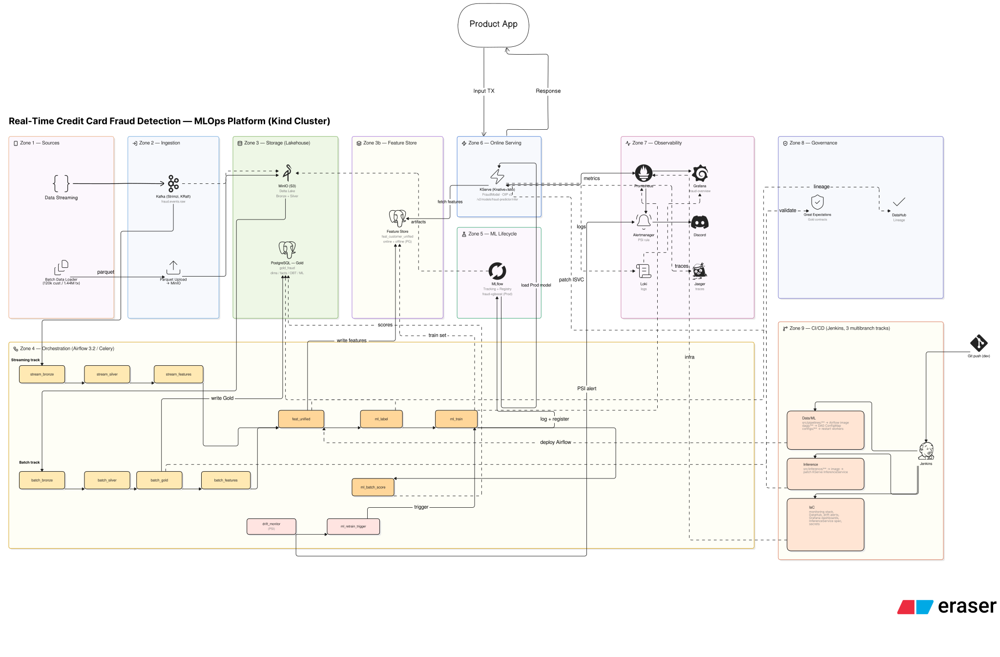
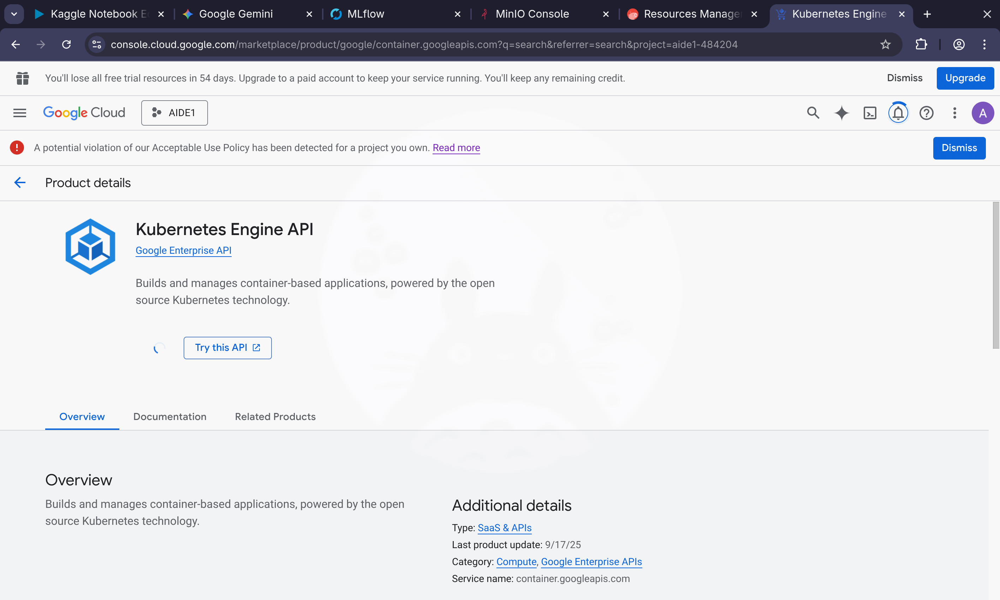
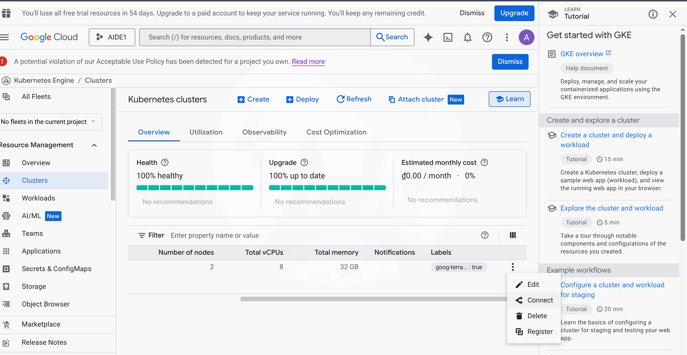
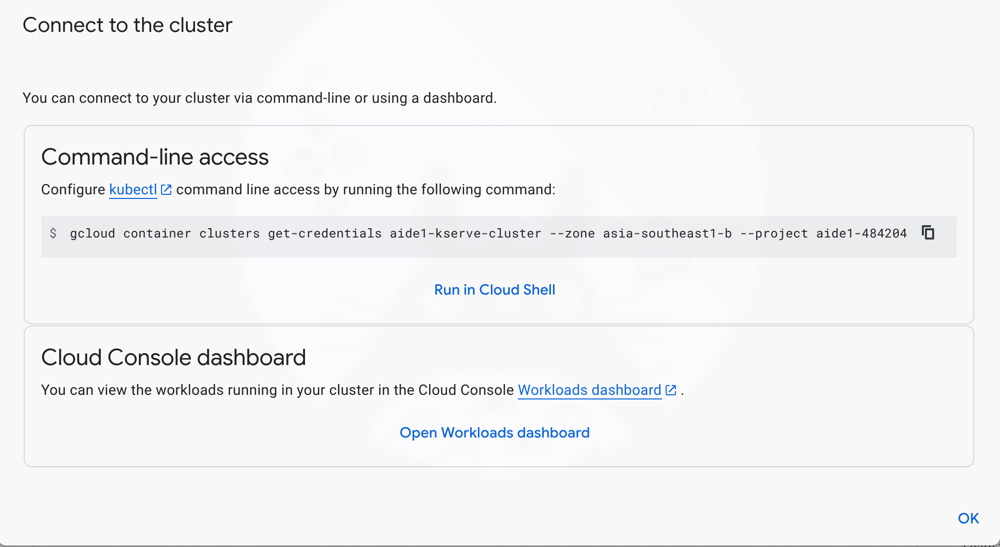
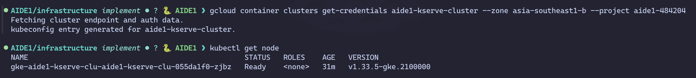
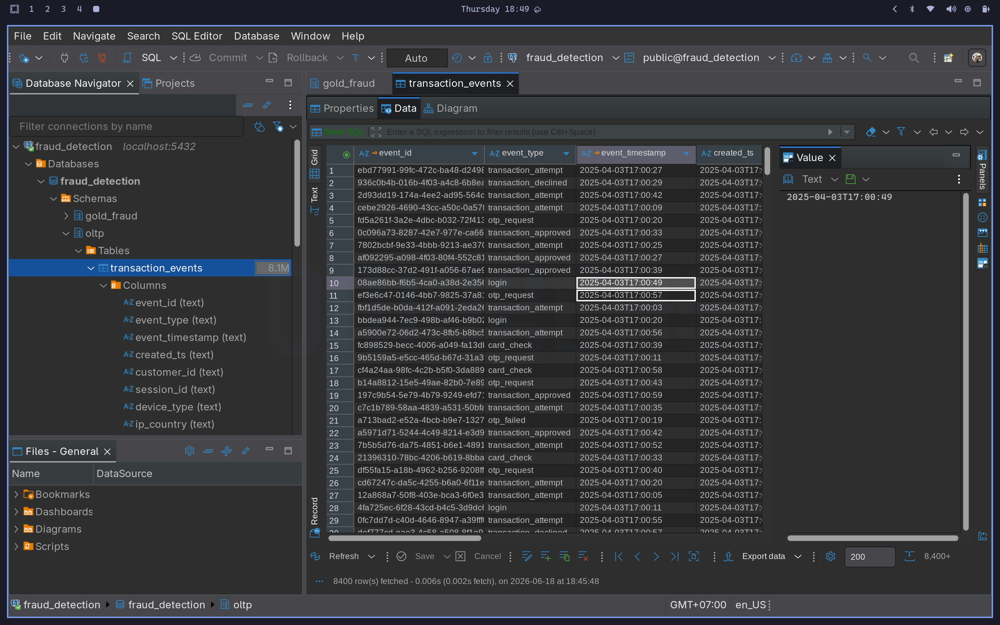
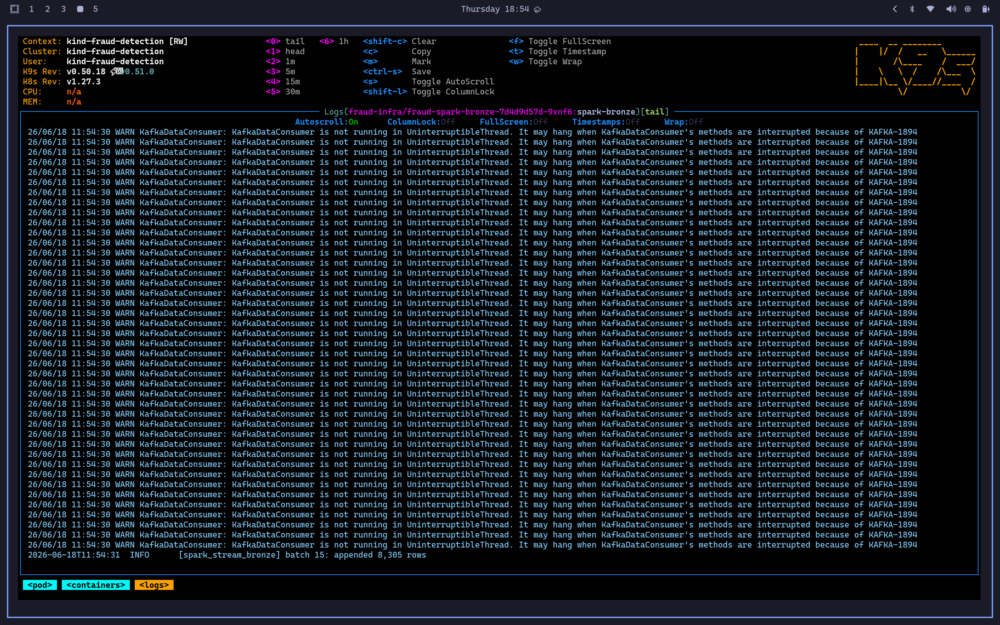
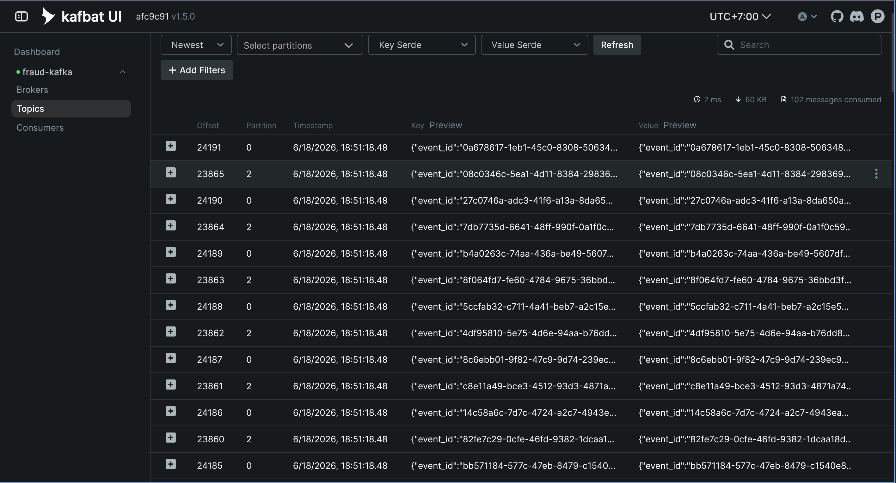
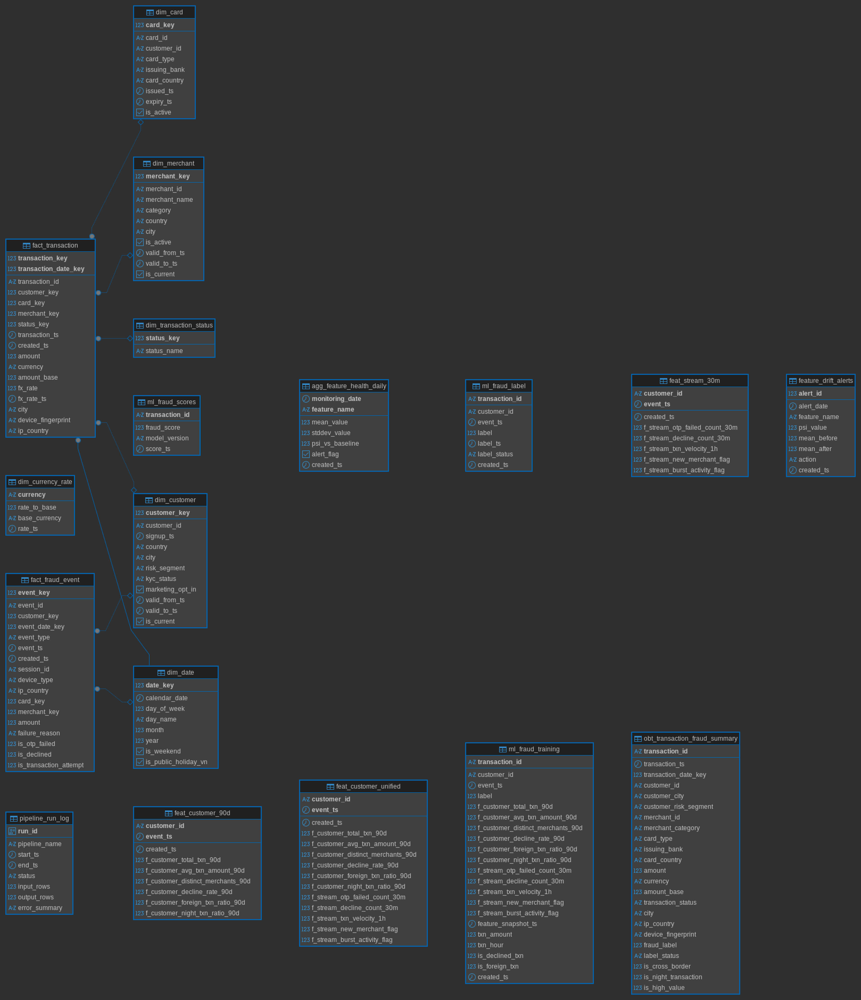

<div align="center">

# 🛡️ Fraud Detection — End-to-End Data & MLOps Platform

**Real-time credit-card fraud scoring on Kubernetes — the full ML lifecycle: ingestion → feature engineering → training → online inference → drift monitoring → CI/CD.**


</div>

---

## 📑 Table of Contents

- [Architecture](#-architecture)
- [Tech Stack](#-tech-stack)
- [Prerequisites](#-prerequisites)
- [Quick Start](#-quick-start)
  - [Component Setup Guides](#component-setup-guides)
- [Data Model](#-data-model)
- [Running Tests](#-running-tests)
- [Design Documents](#-design-documents)
- [Repository Layout](#-repository-layout)

---

## 🏗️ Architecture

The platform follows a **medallion architecture** (Bronze → Silver → Gold → Feature Store) feeding an ML lifecycle, all inside a single Kind cluster. Batch and streaming tracks converge at a unified feature store; the trained model is served online via KServe and scored in batch via Airflow.

<p align="center">
  
</p>

---

## 🧰 Tech Stack

| Layer | Technology |
|---|---|
| **Orchestration** | Apache Airflow 3.2.0 (CeleryExecutor) |
| **Storage** | PostgreSQL (Gold) · MinIO + Delta Lake (Bronze/Silver) |
| **Streaming** | Apache Kafka (Strimzi, KRaft) |
| **ML** | XGBoost · MLflow (tracking + registry) |
| **Serving** | KServe 0.12.0 + Knative + Istio (open-inference-protocol V2) |
| **Observability** | Prometheus · Grafana · Alertmanager → Discord · Loki · Jaeger |
| **Governance** | Great Expectations (data contracts) · DataHub (lineage) |
| **CI/CD** | Jenkins (3 multibranch pipelines) |

---

## ✅ Prerequisites

| Tool | Version | Notes |
|---|---|---|
| [Docker](https://docs.docker.com/get-docker/) | 24+ | Container runtime |
| [kind](https://kind.sigs.k8s.io/) | 0.20+ | Local Kubernetes cluster |
| [kubectl](https://kubernetes.io/docs/tasks/tools/) | 1.29+ | Cluster management |
| [helm](https://helm.sh/docs/intro/install/) | 3.x | Chart deployments |
| [Python](https://www.python.org/) | 3.11+ | Pipeline + inference code |
| [uv](https://docs.astral.sh/uv/) | latest | Fast Python package manager |

> [!NOTE]
> Tested on a single-node Kind cluster with **~22 GiB RAM**. The full stack (incl. DataHub + KServe) is memory-hungry — deploy only what you need, and check `free -h` before heavy components.

---

## 🚀 Quick Start

This walks through a full, from-scratch setup in **best-practice dependency order**. Each component links to its detailed guide in [`docs/`](docs/) — follow them in order.
### 1. Set up cluster 
#### 1.1 Using GKE 
**Login gcp:**
```bash
gcloud auth application default login
```
Then enable Kubernets Engine API

**Provision**
```bash
cd IaC
terraform init
terraform plan
terraform apply
```
**Connect to GKE**



#### 1.2 Using Kind Cluster
```bash
kind create cluster --name fraud-detection
kubectl config current-context        # → kind-fraud-detection
```
### 2. Helm repos & namespaces

```bash
helm repo add apache-airflow https://airflow.apache.org
helm repo add bitnami https://charts.bitnami.com/bitnami
helm repo add minio https://charts.min.io/
helm repo add prometheus-community https://prometheus-community.github.io/helm-charts
helm repo add grafana https://grafana.github.io/helm-charts
helm repo add jaegertracing https://jaegertracing.github.io/helm-charts
helm repo add community-charts https://community-charts.github.io/helm-charts
helm repo add datahub https://helm.datahubproject.io/
helm repo add jenkins https://charts.jenkins.io
helm repo update

for ns in fraud-infra airflow monitoring datahub jenkins; do kubectl create namespace $ns; done
```

### 3. Generate the dataset (local)

```bash
python src/generator/generate_data.py --config configs/generate_config.yaml
```

Produces `data/raw/offline/` (Parquet) + `data/raw/streaming/fraud_events.json` — 120k customers · ~1.44M transactions · 180 days · 10% fraud · amount-drift scenario from 2025-08-01.

### 4. Core infra — PostgreSQL · MinIO · Airflow

> 📄 **[docs/airflow.md](docs/airflow.md)** — deploy Postgres + MinIO, build & push the Airflow image, upload raw data to MinIO, init the Gold schema, install Airflow, and load the 14 DAGs.

### 5. MLflow — experiment tracking & model registry

> 📄 **[docs/mlflow.md](docs/mlflow.md)** — MLflow server with a SQLite backend + MinIO artifact store; replaces the legacy Postgres registry table.

### 6. Streaming — Kafka · CDC · Spark

> 📄 **[docs/streaming-cdc.md](docs/streaming-cdc.md)** — the full streaming track in one guide: Strimzi/KRaft Kafka + topic `fraud.events.raw`, then Postgres OLTP → Debezium CDC → Kafka → Spark Structured Streaming → Delta Bronze (replaces the legacy micro-batch consumer).

### 7. Observability — Prometheus · Grafana · Loki · Jaeger

> 📄 **[docs/observability.md](docs/observability.md)** — the full metrics + logs + traces stack: kube-prometheus-stack + Pushgateway + Grafana dashboard + drift alerts → Discord, Loki/Promtail logs (LogQL), and Jaeger tracing (`fetch_features` vs `score_model`).

### 8. Governance — contracts & lineage

> 📄 **[docs/governance.md](docs/governance.md)** — Great Expectations data contracts + Data Docs (Gold quality gate) and DataHub for auto-emitted Bronze→Silver→Gold→Feature lineage.

### 9. Online inference — KServe

> 📄 **[docs/kserve.md](docs/kserve.md)** — cert-manager / Istio / Knative / KServe, build & deploy the `FraudModel` InferenceService (V2 protocol).

### 10. CI/CD — Jenkins

> 📄 **[docs/jenkins.md](docs/jenkins.md)** — Jenkins on-cluster with 3 multibranch pipelines (data/ML, inference, IaC).

### 11. Upload raw data offline to Minio 
```bash
uv run scripts/setup/upload_raw_to_minio.py
```


### 12. Streaming data
The generator writes events into OLTP; Debezium streams them out. Run it from a laptop over the same port-forward (`POSTGRES_HOST`/`POSTGRES_PORT` overrides):
```bash
kubectl port-forward svc/fraud-postgres-postgresql -n fraud-infra 15432:5432 &
POSTGRES_HOST=127.0.0.1 POSTGRES_PORT=15432 \
  uv run -m src.generator.streaming.oltp_writer replay \
  --source data/raw/streaming/fraud_events.json --speed 3600 --max-events 200000
```
**Database streaming event:**
 
**Logs Spark Job:**

**Check the data stream:**

Port-forward `kafka ui` and access a `localhost:8080`:

### 13. Test Inference
```bash
uv run scripts/validate/test_inference.py
```
### Component Setup Guides

| # | Component | Namespace | Guide |
|---|---|---|---|
| 4 | PostgreSQL · MinIO · Airflow | `fraud-infra`, `airflow` | [airflow.md](docs/airflow.md) |
| 5 | MLflow | `fraud-infra` | [mlflow.md](docs/mlflow.md) |
| 6 | Streaming — Kafka · CDC · Spark | `fraud-infra` | [streaming-cdc.md](docs/streaming-cdc.md) |
| 7 | Observability — Prometheus · Grafana · Loki · Jaeger | `monitoring`, `fraud-infra` | [observability.md](docs/observability.md) |
| 8 | Governance — Great Expectations · DataHub | `datahub` | [governance.md](docs/governance.md) |
| 9 | KServe Inference | `fraud-infra` | [kserve.md](docs/kserve.md) |
| 10 | Jenkins CI/CD | `jenkins` | [jenkins.md](docs/jenkins.md) |

---

## 🗃️ Data Model

Gold schema (`gold_fraud` in PostgreSQL) — dimensions, facts, OBT, feature store, and ML tables:

<p align="center">
  
</p>

See [`design/02_schema_design.md`](design/02_schema_design.md) for the full schema design.

---

## 🧪 Running Tests

```bash
uv pip install -r requirements.txt
.venv/bin/python -m pytest tests/ -q        # 262 passing (unit + integration)
```

Validate Gold data contracts after pipelines complete:

```bash
kubectl port-forward svc/fraud-postgres-postgresql -n fraud-infra 15432:5432 &
python scripts/validate/validate_contracts.py     # Great Expectations → Data Docs
```

| Table | Expected |
|---|---|
| `gold_fraud.fact_transaction` | ~1,440,000 rows |
| `gold_fraud.ml_fraud_training` | ~1,440,000 rows |
| `gold_fraud.ml_fraud_scores` | ~1,440,000 rows |
| MLflow `fraud-xgboost` | v1 @ Production · PR-AUC ≈ 0.8178 |

---

## 📐 Design Documents

| # | Document |
|---|---|
| 01 | [Data Generator](design/01_data_generator.md) |
| 02 | [Gold Schema Design](design/02_schema_design.md) |
| 03 | [Drift Simulation & Labels](design/03_data_generator_improvement.md) |
| 04.1 | [ML Design](design/04.1_ml_design.md) |

---

## 📂 Repository Layout

```
configs/        # generate_config.yaml · pipeline_config.yaml
dags/           # 14 Airflow DAGs (batch · stream · feature · ML · drift)
design/         # design documents (01–04.1)
docs/           # component setup guides + assets/ (screenshots, ERD)
infra/          # docker/ · helm/ · k8s/ manifests
jenkins/        # Jenkinsfile.track_a / _b / _c
scripts/        # setup/ (cluster bootstrap) · validate/ · governance/
src/            # generator/ · inference/ (KServe) · pipelines/ (bronze→ml)
tests/          # unit/ · integration/  (262 tests)
```
