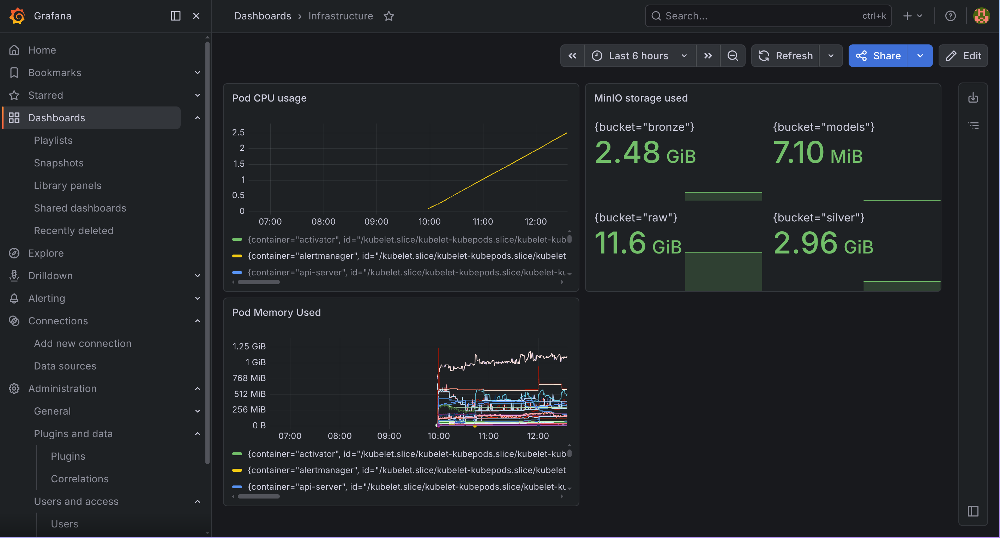
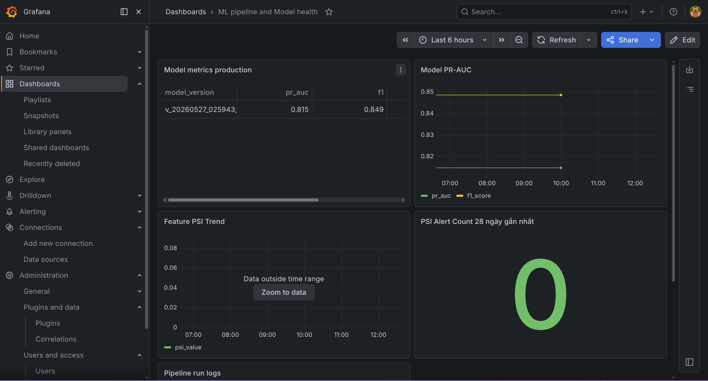
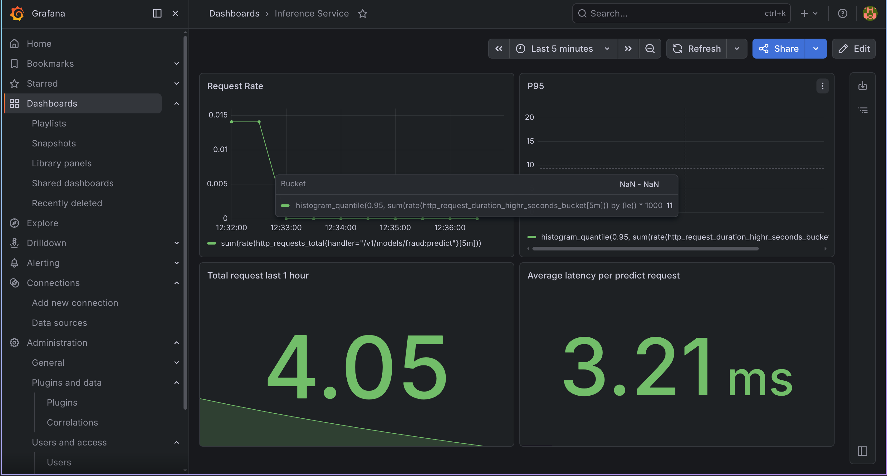

# Fraud Detection ML Design

**NOTE (for students):** This file is the ML design document for Session 04.
It follows the structure of `04.1_ml_design_example.md` and is based on
infrastructure built in Sessions 02 and 03.

---

## 1. Goal

Build a real-time fraud scoring system on top of the Gold data and feature tables
built in Sessions 02 and 03.

**Task:** predict whether a transaction is fraudulent at the time it occurs.

**Why this task:**
- Fraud causes direct financial loss; early detection minimises chargeback cost.
- The task uses both offline 90-day batch features and near-real-time 30-minute streaming features, exercising the full feature store.
- The training label (`is_fraud`) is already derived deterministically from ≥ 2 fraud conditions in `fact_transaction`, giving a consistent ground truth.
- Amount drift detected in Session 03 (PSI > 0.025 from Aug 26) provides a natural retraining trigger, connecting the drift monitoring pipeline to the ML lifecycle.

---

## 2. Prediction Setup and Modeling Plan

**Prediction setup**
- Entity: `transaction_id`
- Label: `is_fraud` (1 = fraud, 0 = legitimate)
- Prediction time: use the feature snapshot at `event_timestamp` of each transaction
- Class distribution: ~90% legitimate / ~10% fraud (~1,296,000 / ~144,000 out of 1,440,000 rows)

**Training data input**
- Table: `gold_fraud.ml_fraud_training` (created in Session 03, Gold zone)
- Grain: one row per `transaction_id`
- Columns: `transaction_id`, `customer_id`, `event_timestamp`, `label`, and 11 feature columns from `feat_customer_unified`
- Use: model training input

**Features used**

| Feature | Source | Window | Notes |
|---------|--------|--------|-------|
| `f_customer_total_txn_90d` | feat_customer_90d | Batch 90d | |
| `f_customer_avg_txn_amount_90d` | feat_customer_90d | Batch 90d | Denominator for `txn_amount_ratio` |
| `f_customer_distinct_merchants_90d` | feat_customer_90d | Batch 90d | |
| `f_customer_decline_rate_90d` | feat_customer_90d | Batch 90d | |
| `f_customer_foreign_txn_ratio_90d` | feat_customer_90d | Batch 90d | |
| `f_customer_night_txn_ratio_90d` | feat_customer_90d | Batch 90d | |
| `f_stream_otp_failed_count_30m` | stg_fraud_events | Streaming 30m | Per-transaction sliding window |
| `f_stream_decline_count_30m` | stg_fraud_events | Streaming 30m | Per-transaction sliding window |
| `f_stream_txn_velocity_1h` | stg_fraud_events | Streaming 1h | Per-transaction sliding window |
| `f_stream_new_merchant_flag` | stg_fraud_events | Streaming 30m | Per-transaction sliding window |
| `f_stream_burst_activity_flag` | stg_fraud_events | Point-in-time | |
| `txn_amount` | fact_transaction | Point-in-time | Raw amount — input to `txn_amount_ratio` |
| `txn_hour` | fact_transaction | Point-in-time | Hour of transaction — input to `is_night_txn` |
| `is_declined_txn` | fact_transaction | Point-in-time | Fraud condition direct encoding |
| `is_foreign_txn` | fact_transaction + dim_card | Point-in-time | ip_country ≠ card_country |
| `txn_amount_ratio` | derived | — | `txn_amount / f_customer_avg_txn_amount_90d` — captures 3× anomaly condition |
| `is_night_txn` | derived | — | `txn_hour BETWEEN 1 AND 4` — night fraud condition |

**Modeling decisions**
- Split strategy: **fraction-based time split** — 70% earliest for train, next 15% for validation, last 15% for test. Boundaries are computed from actual data timestamps (not hardcoded dates) so the split adapts if the date range changes. Time-based ordering reflects production: model is always scored on future transactions it has never seen.
- Baseline model: **XGBoost** — handles class imbalance well via `scale_pos_weight`, natively supports missing features (sparse streaming features for early transactions), and produces feature importances without extra overhead.
- Class imbalance handling: `scale_pos_weight` computed dynamically from training split — `neg / pos ≈ 9` at 10% fraud rate (1,296,000 / 144,000). Value is recalibrated on each retrain as class ratio may shift over time.
- Metrics: **PR-AUC** as primary metric (appropriate for severe class imbalance — accuracy and ROC-AUC are misleading at 2% fraud rate). Secondary: **F1 @ threshold 0.5**, **Precision**, **Recall**.
- Acceptance threshold: PR-AUC ≥ 0.70 to promote model to production.

**Assumptions**
- Business objective: minimise fraud loss (false negatives) while controlling false positive rate to avoid blocking legitimate customers (precision-recall trade-off).
- Decision usage: scores are used for transaction blocking or step-up authentication; a human review queue handles borderline cases (score 0.4–0.7).
- Service level expectation: batch scores refreshed daily; online inference available for real-time channel within latency target.
- Explainability: SHAP feature importances logged per model version; not served per-request in this phase.
- Risk and governance: model version tracked in registry; rollback path required.

**SLA targets**

| Target | Value |
|--------|-------|
| Online inference latency | p95 < 50 ms |
| Batch score freshness | < 24 hours |
| Stream feature freshness | < 5 minutes (feat_stream_30m DAG) |
| Batch feature freshness | < 60 minutes (feat_customer_90d DAG) |

Given coursework compute constraints (single-node Kind cluster), achieved SLA values are reported after implementation.

---

## 3. High-Level ML Design

End-to-end flow:
1. Build and validate `ml_fraud_training` from Gold feature/label inputs (done in Session 03).
2. Run the training pipeline (dataset build → train → evaluate → register model).
3. Run the retrain-trigger pipeline (PSI drift alert OR F1 drop → retrain → evaluate → promote or rollback).
4. Run batch scoring pipeline: score all transactions daily, write to `ml_fraud_scores`.
5. Run online inference service: FastAPI serving the registered model for real-time channel scoring.
6. Monitor logs, metrics, and traces for compute resources, data pipelines, and ML services.

### 3.1 Security Decision

- `ml_fraud_training` and `ml_fraud_scores` are accessible only to the training service account (PostgreSQL role `fraud_user`); production inference reads scores via a read-only role.
- Model artifacts stored in MinIO bucket `models/` — write access restricted to the CI/CD service identity; read access for the inference service only.
- Inference API requires Bearer token authentication; tokens are injected via Kubernetes Secrets, never hardcoded.
- Credentials (`POSTGRES_PASSWORD`, `MINIO_ACCESS_KEY`, `MINIO_SECRET_KEY`) are managed as K8s Secrets referenced in Airflow `env` values — already in place in `infra/helm/airflow/values.yaml`.

### 3.2 Resilience Decision

- Training and scoring jobs inherit the existing retry policy from `pipeline_config.yaml`: up to 3 retries with exponential backoff (2 min, 8 min, 32 min).
- Scoring job is partition-idempotent: uses `ON CONFLICT (transaction_id) DO UPDATE` so re-runs do not create duplicate scores.
- Failed canary deployment (model PR-AUC drops > 5% vs production) auto-rolls back to the previous `model_version` tag in the registry.
- Drift-triggered retrain keeps previous model in production until candidate passes evaluation — no blind promotion.

### 3.3 Training/Inference Pattern Decision

- **Training mode:** weekly scheduled training (Sunday 02:00 UTC) + drift-triggered retraining when `feature_drift_alerts` has ≥ 3 consecutive alert weeks (PSI > 0.025 sustained).
- **Inference mode:** precomputed batch scores (primary) + online FastAPI endpoint (secondary for real-time channel).
- **Trade-offs:** batch scoring covers the majority of fraud checks (daily batch card authorisation review); online endpoint handles real-time POS/e-commerce transactions where latency < 50 ms is required. Maintaining both adds operational cost but matches the dual-channel fraud use case.

### 3.4 Storage Decision

- Bronze/Silver: Delta Lake in MinIO (`s3://bronze`, `s3://silver`) — already in place.
- Gold features/labels: PostgreSQL `gold_fraud` schema — already in place.
- Model artifacts: MinIO bucket `s3://models/<model_name>/<model_version>/` — joblib-serialised XGBoost model + preprocessing pipeline + SHAP explainer.
- Model registry: lightweight registry table `gold_fraud.ml_model_registry` in PostgreSQL (model_name, model_version, pr_auc, status, registered_ts).
- Batch scores: `gold_fraud.ml_fraud_scores` PostgreSQL table.
- Logs: structured JSON logs to stdout → collected by Kubernetes logging stack.

### 3.5 Routing/Gateway Decision

- Online inference API exposed as a Kubernetes ClusterIP service (`fraud-inference-svc`) inside the cluster; external access via `kubectl port-forward` in dev/coursework.
- Versioned routing: `/v1/score` always routes to the **production** model version tag; `/v2/score` routes to the **candidate** model for canary testing.
- Canary policy: 10% of online traffic routed to candidate model for 24 hours before full promotion.
- Rate limiting: 100 req/s per client IP to protect the inference pod during load spikes.

---

## 4. Low-Level ML Design

Five core classes covering the full ML lifecycle.
Each class applies one or more patterns from [ML Design Patterns](https://github.com/msaroufim/ml-design-patterns).

### Pattern mapping

| Class | Pattern | Why |
|-------|---------|-----|
| `TrainingDataService` | **Pipeline** | Sequential steps: read → validate → split → fill — output type of each step feeds the next |
| `ModelService` | **Strategy + Learner** | Strategy: swappable classifier behind a common `train()`/`evaluate()` interface; Learner: unified `model.fit(data)` API hiding XGBoost internals |
| `ModelRegistryService` | **Pipeline** | register → promote → rollback form a linear state machine over model versions |
| `ScoringService` | **Iterator + Pipeline** | `score_batch` iterates over 5 000-row chunks (Iterator) and chains score → write as a mini-pipeline |
| `MonitoringService` | **Observer/Callbacks** | Subscribes to training events (`publish_model_metrics`, `trigger_alerts`) without modifying `ModelService` or `train.py` |

```python
# ── Strategy interface (swappable classifier) ─────────────────────────────
from abc import ABC, abstractmethod

class BaseClassifier(ABC):
    @abstractmethod
    def fit(self, X, y) -> None: ...
    @abstractmethod
    def predict_proba(self, X) -> np.ndarray: ...

class XGBoostClassifier(BaseClassifier):   # default strategy
    def fit(self, X, y) -> None: ...
    def predict_proba(self, X) -> np.ndarray: ...

class LogisticRegressionClassifier(BaseClassifier):   # fallback strategy
    def fit(self, X, y) -> None: ...
    def predict_proba(self, X) -> np.ndarray: ...


# ── Pipeline: data preparation ────────────────────────────────────────────
class TrainingDataService:
    """Pipeline pattern: read → validate → split → handle_missing."""
    def read_training_table(self, engine) -> pd.DataFrame: ...
    def validate_schema(self, df: pd.DataFrame) -> None: ...
    def split_by_time(
        self, df: pd.DataFrame,
        train_end: str = "2025-08-01",
        val_end: str   = "2025-09-01",
    ) -> tuple[pd.DataFrame, pd.DataFrame, pd.DataFrame]: ...
    def handle_missing_features(self, df: pd.DataFrame) -> pd.DataFrame: ...


# ── Strategy + Learner: model training ───────────────────────────────────
class ModelService:
    """Strategy pattern: accepts any BaseClassifier.
    Learner pattern: unified train()/evaluate() API."""
    def __init__(self, cfg: dict, classifier: BaseClassifier | None = None):
        # Default strategy: XGBoost; swap at construction time for experiments
        self.classifier = classifier or XGBoostClassifier()

    def train(self, train_df: pd.DataFrame) -> object:
        # Learner pattern: single fit() call, class-imbalance handled internally
        ...
    def evaluate(self, model, test_df: pd.DataFrame) -> dict:
        # Returns: pr_auc, f1, precision, recall, threshold
        ...
    def save_model(self, model, metrics: dict, model_version: str) -> str:
        # Serialise to s3://models/fraud_xgb/<version>/model.pkl
        ...
    def load_model(self, artifact_path: str) -> ModelArtifact: ...


# ── Pipeline: model lifecycle ─────────────────────────────────────────────
class ModelRegistryService:
    """Pipeline pattern: register → promote → rollback state machine."""
    def register(
        self, model_version: str, metrics: dict,
        artifact_path: str, train_rows: int, status: str = "candidate",
    ) -> None: ...
    def get_production_version(self) -> dict | None: ...
    def promote(self, model_version: str) -> None: ...
    def rollback(self, previous_version: str) -> None: ...


# ── Iterator + Pipeline: batch scoring ───────────────────────────────────
class ScoringService:
    """Iterator pattern: score_batch processes df in 5 000-row chunks.
    Pipeline pattern: score_batch → write_scores form a sequential chain."""
    def score_batch(
        self, artifact: ModelArtifact, df: pd.DataFrame,
        chunk_size: int = 5_000,
    ) -> pd.DataFrame:
        # Iterator: yields chunk → score → concat
        # Returns: transaction_id, fraud_score, model_version, score_ts
        ...
    def write_scores(self, score_df: pd.DataFrame, engine) -> None:
        # Upsert to gold_fraud.ml_fraud_scores ON CONFLICT (transaction_id)
        ...
    def score_online(self, artifact: ModelArtifact, features: dict) -> dict:
        # Returns: fraud_score, model_version, latency_ms
        ...


# ── Observer/Callbacks: monitoring ───────────────────────────────────────
class MonitoringService:
    """Observer pattern: attached to training pipeline as a side-effect listener.
    Does not modify ModelService or train.py — only observes and reacts."""
    def publish_model_metrics(self, metrics: dict, model_version: str) -> None:
        # Log pr_auc, f1 to pipeline_run_log
        ...
    def check_retrain_trigger(
        self,
        psi_threshold: float = 0.025,
        consecutive_weeks: int = 3,
        f1_drop_threshold: float = 0.05,
    ) -> tuple[bool, str]:
        # Returns (should_retrain, reason)
        ...
    def trigger_alerts(self, metrics: dict) -> None:
        # Fire alert if PR-AUC < 0.70 or F1 < 0.30
        ...
```

---

## 5. Infrastructure Decision

**Choice: Kubernetes (existing Kind cluster)**

The project already runs on a Kind K8s cluster with Airflow CeleryExecutor, MinIO, and PostgreSQL. Extending it for ML training and inference avoids introducing a new platform.

**Node resource plan**

| Workload | CPU request | Memory request | Notes |
|----------|-------------|----------------|-------|
| Airflow worker (training/scoring jobs) | 500m | 2 Gi | XGBoost on 1.44M rows fits in memory |
| Inference FastAPI pod | 200m | 512 Mi | Stateless; model loaded once at startup |
| MinIO | 200m | 512 Mi | Existing |
| PostgreSQL | 200m | 1 Gi | Existing |

**Storage sizing**
- Model artifacts: ~50 MB per version × 10 versions = 500 MB in `s3://models/`
- Batch scores table: 1.44M rows × ~100 bytes = ~144 MB in PostgreSQL
- Training data: already in `ml_fraud_training` (~800 MB)

**Scaling policy**
- Training jobs: single Airflow worker pod is sufficient for weekly batch on 1.44M rows (~5–10 min with XGBoost).
- Inference pod: Horizontal Pod Autoscaler (HPA) scales 1→3 replicas when CPU > 70% — handles burst real-time traffic.
- Drift-triggered retrain overlaps with weekly schedule at most once: worker resource limit set to prevent OOM.

---

## 6. Pipeline Design

All data and feature pipelines (Bronze/Silver/Gold and feat_customer_90d, feat_stream_30m, feat_unified) are implemented in Sessions 02/03 and reused as upstream dependencies.

### Pipeline A: Training Pipeline

DAG: `dag_ml_train` — scheduled weekly `0 2 * * 0` (Sunday 02:00 UTC)

1. `build_training_dataset`
   - Reads `ml_fraud_training` from PostgreSQL
   - Validates schema, deduplicates by `created_ts`
   - Applies time-based split: train < 2025-08-01, val Aug 2025, test Sep 2025
2. `train_model`
   - Trains XGBoost with `scale_pos_weight=49`, `max_depth=6`, `n_estimators=300`
   - Serialises model + preprocessing pipeline to `s3://models/fraud_xgb/<version>/`
3. `evaluate_model`
   - Computes PR-AUC, F1, Precision, Recall on test set
   - Fails task if PR-AUC < 0.70 (acceptance threshold)
4. `register_model`
   - Inserts record into `gold_fraud.ml_model_registry` with `status='candidate'`
   - Promotes to `status='production'` if PR-AUC ≥ current production model

### Pipeline B: Batch Scoring Pipeline

DAG: `dag_ml_batch_score` — scheduled daily `0 5 * * *`

1. `load_production_model`
   - Reads `model_version` tagged `production` from registry
   - Loads model artifact from MinIO
2. `score_transactions`
   - Reads yesterday's `fact_transaction` joined with latest feature snapshot
   - Produces `fraud_score` (0–1) per `transaction_id`
3. `write_scores`
   - Upserts to `gold_fraud.ml_fraud_scores (transaction_id, fraud_score, model_version, score_ts)`
   - `ON CONFLICT (transaction_id) DO UPDATE` — idempotent

### Pipeline C: Retrain Trigger Pipeline

DAG: `dag_ml_retrain_trigger` — scheduled daily `0 7 * * *`

1. `check_drift_alerts`
   - Queries `feature_drift_alerts`: if ≥ 3 consecutive weeks with `psi_value > 0.025` → set `retrain_needed = True`
2. `check_model_quality`
   - Scores a held-out validation slice using production model
   - If F1 drops > 5% vs registered baseline → set `retrain_needed = True`
3. `trigger_retrain` *(conditional on retrain_needed)*
   - Triggers `dag_ml_train` with `force=True` and updated train window
4. `promote_or_rollback`
   - If candidate PR-AUC ≥ production PR-AUC − 0.01: promote candidate → production
   - Otherwise: keep current production model, log rollback event

### CI/CD Pipeline Design

CI/CD is implemented as **3 merged Jenkinsfiles** (each file covers both CI + CD for its track). Jenkins runs on the Kind cluster, deployed via Helm. Each stage uses `when { changeset "..." }` to skip unrelated stages — only the components whose files changed are rebuilt and redeployed. All 3 pipelines support **manual full-deploy** (empty changeset on `main` auto-enables all CD stages; `FORCE_DEPLOY=true` parameter works on any branch).

Jenkins agent: custom Docker image `ancaotrinh/jenkins-agent:latest` (kubectl v1.29, Helm 3, Docker CLI, Python 3) running in a Kubernetes pod template with `/var/run/docker.sock` mounted. Setup documented in `docs/jenkins-setup.md`.

**Track A: `jenkins/Jenkinsfile.track_a` — Data/ML Pipelines**

CI stages (run on `src/pipelines/**`, `dags/**`, `config/**` change):
- Install dependencies (ruff, pytest, scikit-learn, xgboost, airflow)
- Lint: `ruff check src/pipelines/ dags/`
- Unit tests: `pytest tests/unit/` — 183 tests covering all 5 ML service classes
- Integration tests: `pytest tests/integration/` — 88 tests (train pipeline, batch score, retrain trigger)
- DAG import validation: dynamic import of all DAGs, fail on parse error

CD stages (run on `main` only, guarded by changeset):
- `src/pipelines/**` or `infra/docker/airflow/**` → build `ancaotrinh/fraud-airflow:<sha>` → push → `helm upgrade airflow 1.21.0`
- `infra/helm/airflow/**` → `helm upgrade airflow 1.21.0` (values-only, no image rebuild)
- `dags/**` → update `airflow-dags` ConfigMap → rollout restart `dag-processor`
- `config/pipeline_config.yaml` → update `fraud-pipeline-config` ConfigMap → rollout restart workers
- Verify worker `StatefulSet` rollout and print scheduler DAG list

Rollback: `helm rollback airflow 0 -n airflow`

**Track B: `jenkins/Jenkinsfile.track_b` — Inference Service**

CI stages (run on `src/inference/**`, `tests/**` change):
- Install dependencies (fastapi, httpx, pydantic, prometheus-fastapi-instrumentator)
- Lint: `ruff check src/inference/ src/pipelines/`
- Unit tests: `pytest tests/unit/`
- API contract tests: `pytest tests/integration/test_inference_contract.py` — validate `POST /v1/models/fraud:predict` response shape
- Load test: 100 in-process requests via `TestClient`, assert p95 < 500 ms

CD stages (run on `main` only):
- `src/inference/**` or `infra/docker/inference/**` → build `ancaotrinh/fraud-inference:<sha>` → push → `kubectl patch inferenceservice fraud` with new image tag
- `infra/k8s/fraud-inference.yaml` → `kubectl apply` (spec-only, no image rebuild)
- Wait for `InferenceService` Ready condition (30 × 10 s polling)
- Smoke test: port-forward predictor pod → `/v2/health/ready` + `/v1/models/fraud:predict`

Rollback: `kubectl patch inferenceservice fraud` with previous `<sha>` tag

**Track C: `jenkins/Jenkinsfile.track_c` — IaC**

CI stages (run on `infra/**` change):
- Helm lint: kube-prometheus-stack, airflow, datahub charts
- `kubectl apply --dry-run=client` for all K8s manifests in `infra/k8s/`
- Validate DAG ConfigMap key names match `dags/*.py` filenames

CD stages (separate per component, each guarded by its own changeset):
- Ensure namespaces exist (`airflow`, `fraud-infra`, `monitoring`, `datahub`)
- `infra/k8s/fraud-pipeline-secret.yaml` → `kubectl apply`
- `infra/k8s/net-istio.yaml` → `kubectl apply` (Istio/Knative config)
- `infra/k8s/pushgateway.yaml` → `kubectl apply` + rollout status
- `infra/k8s/fraud-inference-monitor.yaml` → `kubectl apply` ServiceMonitor
- `infra/helm/monitoring/**` → `helm upgrade kube-prometheus-stack 85.2.0`
- `infra/helm/datahub/prerequisites-values.yaml` → `helm upgrade datahub-prerequisites 0.3.0`
- `infra/helm/datahub/datahub-values.yaml` → `helm upgrade datahub 0.9.12`
- `infra/helm/airflow/**` (without `src/pipelines/**`) → `helm upgrade airflow 1.21.0` (values-only)
- Post-apply health checks: pod Running/Ready status for each namespace

Rollback: `helm rollback` for monitoring, airflow, datahub releases

---

## 7. Monitoring

**Data drift monitoring** (already implemented in Session 03)
- `dag_drift_monitor` runs daily, computes weekly PSI of `amount` distribution
- Alert when PSI > 0.025 → logged to `feature_drift_alerts`
- ≥ 3 consecutive alert weeks → triggers `dag_ml_retrain_trigger`

**Prediction drift monitoring**
- Track daily distribution of `fraud_score` in `ml_fraud_scores`
- Alert when mean daily score shifts > 20% vs 7-day rolling average (potential model or data issue)

**Label drift monitoring**
- Track weekly fraud rate in `fact_transaction` (should remain ~2%)
- Alert when fraud rate > 5% or < 0.5% (generator config: `fraud_rate_min: 0.005`, `fraud_rate_max: 0.050` in `pipeline_config.yaml`)

**Infrastructure monitoring**
- Logs: structured JSON from all Airflow tasks and inference service → collected by K8s log aggregator
- Metrics: Airflow task duration, worker CPU/memory, PostgreSQL connection pool, MinIO object count
- Traces: inference request spans — `request_received → feature_lookup → model_score → response_sent`

**Alert thresholds**

| Signal | Threshold | Action |
|--------|-----------|--------|
| Feature PSI | > 0.025 for ≥ 3 weeks | Trigger retrain pipeline |
| F1 drop | > 5% vs baseline | Trigger retrain pipeline |
| Daily fraud rate | < 0.5% or > 5% | Page on-call |
| Inference p95 latency | > 50 ms | Scale up inference pod |
| Scoring job failure | Any failure | Retry × 3, then alert |

**Evidence — Grafana dashboards (implemented)**

*Dashboard 1: Fraud Infrastructure* — K8s pod CPU/memory, Airflow task metrics, MinIO storage, PostgreSQL connections.



*Dashboard 2: ML Pipeline & Model Health* — Production model PR-AUC over time, feature PSI trend, pipeline run log success/failure, daily fraud rate (label drift).



*Dashboard 3: Inference Service* — Request rate, p95 latency vs 50ms SLA target, error rate, latency distribution. Metrics exposed via `prometheus-fastapi-instrumentator` at `/metrics`, scraped by Prometheus via `ServiceMonitor`.



---

## 8. Retraining Strategy

**Scheduled retrain:** weekly (Sunday 02:00 UTC) — uses a rolling 6-month training window to capture recent fraud patterns.

**Triggered retrain:** activated when `dag_ml_retrain_trigger` detects:
- Feature drift: ≥ 3 consecutive weeks with PSI > 0.025 on `f_customer_avg_txn_amount_90d`
- Model quality: F1 drops > 5% on held-out validation slice vs registered baseline

**Operational rules:**
1. Rebuild `ml_fraud_training` with the latest 6-month window (rolling).
2. Train XGBoost candidate model with same hyperparameters + `scale_pos_weight` recalibrated to current class ratio.
3. Evaluate candidate on the most recent 30-day test slice.
4. Compare PR-AUC: candidate vs current production model.
5. **Promote** candidate if PR-AUC ≥ production PR-AUC − 0.01 (allow small variance).
6. **Rollback** to previous `model_version` if candidate fails evaluation or if post-deploy error rate spikes.
7. Retain last 3 model versions in `s3://models/` and registry for rollback path.

---

## 9. Deliverables

1. **ML design document** ✅ (this file) — prediction setup, modeling plan, and all design decisions.
2. **Training pipeline** ✅ Implemented — `dag_ml_train` (weekly `0 2 * * 0`): build dataset → train XGBoost → evaluate (PR-AUC ≥ 0.70) → register. Implementation: `src/pipelines/ml/train.py`, `src/pipelines/ml/services.py`.
3. **Batch scoring pipeline** ✅ Implemented — `dag_ml_batch_score` (daily `0 5 * * *`): load production model from registry → score yesterday's transactions → upsert to `gold_fraud.ml_fraud_scores`. Implementation: `src/pipelines/ml/batch_score.py`.
4. **Retrain trigger pipeline** ✅ Implemented — `dag_ml_retrain_trigger` (daily `0 7 * * *`): check PSI drift + F1 quality → trigger retrain if needed → promote or rollback. Implementation: `src/pipelines/ml/retrain_trigger.py`.
5. **Online inference service** ✅ Implemented — FastAPI custom container deployed on KServe v0.12.0 + Knative. Endpoint `POST /v1/models/fraud:predict` fetches features from `feat_customer_unified`, scores production model, returns `fraud_score` + `is_fraud`. Setup documented in `docs/kserve-setup.md`.
6. **Model registry table** ✅ Implemented — `gold_fraud.ml_model_registry` with version, PR-AUC, and status. Production model PR-AUC = 0.8148.
7. **CI/CD pipelines** ✅ Implemented — Jenkins-based CI/CD for all 3 tracks. 3 merged Jenkinsfiles (CI + CD per track) in `jenkins/`. Jenkins deployed via Helm on Kind Kubernetes cluster. Custom agent image `ancaotrinh/jenkins-agent:latest` (kubectl, Helm, Docker CLI, Python 3). Changeset detection: each stage runs only when its files change. 183 unit tests + 88 integration tests = 271 total. Setup documented in `docs/jenkins-setup.md`.
8. **Monitoring plan** ✅ Implemented — 3 Grafana dashboards deployed: Infrastructure, ML Pipeline & Model Health, Inference Service. Inference latency metrics via `prometheus-fastapi-instrumentator`. Evidence in `evidence/monitoring_*.png`.
9. **Retraining plan** ✅ Implemented — `dag_ml_retrain_trigger` (daily `0 7 * * *`): checks feature PSI ≥ 3 consecutive alert weeks OR F1 drops > 5% → triggers `dag_ml_train` with updated window → promotes or rolls back. `src/pipelines/ml/retrain_trigger.py` implements `check_drift_alerts`, `check_model_quality`, `trigger_retrain`, `promote_or_rollback`. Rollback policy: keep previous model in production until candidate passes evaluation.
