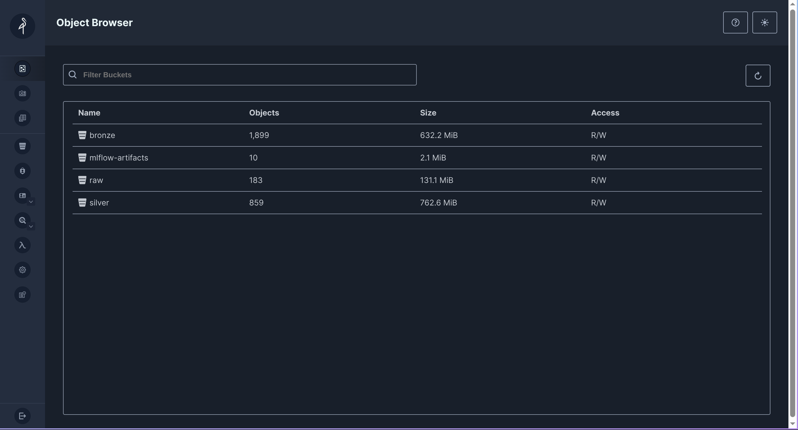
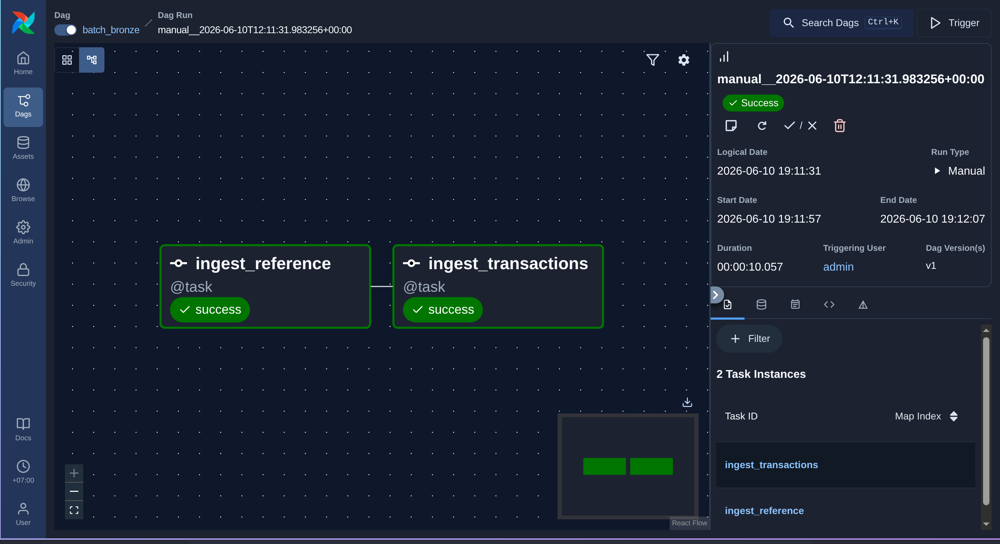
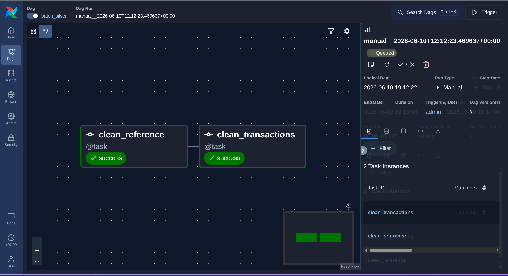
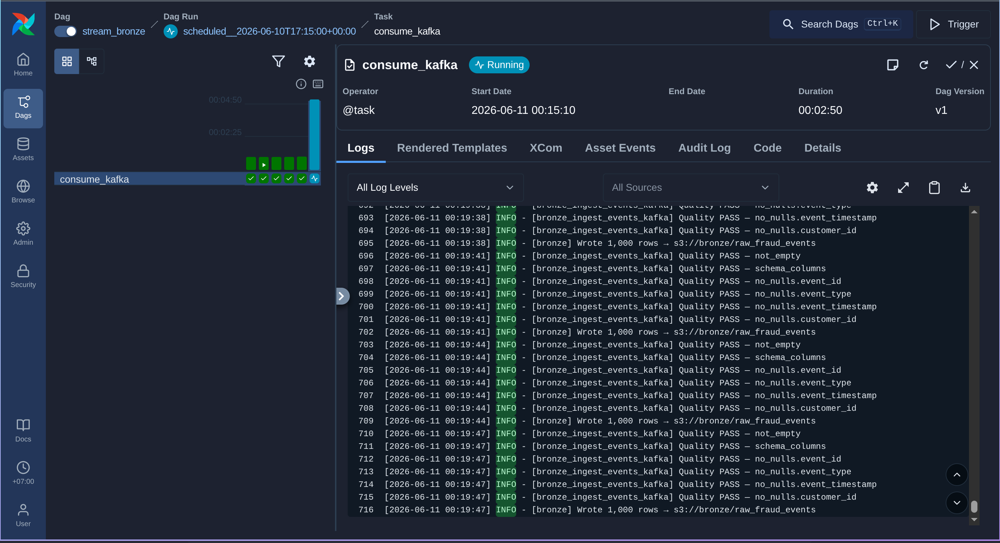

# 🌬️ Airflow Setup

> Deploy the **Fraud Detection** orchestration core on Kubernetes (Kind): PostgreSQL, MinIO, and Apache Airflow with the CeleryExecutor. This is the foundation every other component builds on.

<table>
<tr><th>Component</th><th>Version</th><th>Helm Chart</th></tr>
<tr><td>Apache Airflow</td><td><b>3.2.0</b></td><td><code>apache-airflow 1.21.0</code></td></tr>
<tr><td>PostgreSQL</td><td>18.x</td><td><code>bitnami/postgresql 18.6.2</code></td></tr>
<tr><td>MinIO</td><td>2024-12-18</td><td><code>minio/minio 5.4.0</code></td></tr>
<tr><td>Executor</td><td>Celery</td><td>—</td></tr>
</table>

---

## 📋 Prerequisites

| Tool | Dùng để |
|---|---|
| [Docker](https://docs.docker.com/get-docker/) | Build & push image |
| [kind](https://kind.sigs.k8s.io/) | Tạo Kubernetes cluster local |
| [kubectl](https://kubernetes.io/docs/tasks/tools/) | Tương tác với cluster |
| [helm](https://helm.sh/docs/intro/install/) | Deploy services |
| [uv](https://docs.astral.sh/uv/) | Chạy scripts Python (upload data, init schema) |

<details>
<summary><b>📁 Related files</b></summary>

```
configs/pipeline_config.yaml          # paths + credentials cho pipelines
infra/docker/airflow/
  ├── Dockerfile                       # custom image — extends apache/airflow:3.2.0
  ├── requirements.txt                 # pipeline deps (deltalake, boto3, s3fs, psycopg2)
  └── requirements-governance.txt      # DataHub lineage plugin (separate layer)
infra/helm/airflow/values.yaml         # Helm values cho Kind
dags/                                  # 14 DAG files (TaskFlow API)
scripts/setup/                         # upload_raw_to_minio.py, init_gold_schema.py
src/pipelines/                         # pipeline source (baked vào image)
```
</details>

---

## 🚀 Setup

### 1. Tạo Kind cluster

```bash
kind create cluster --name fraud-detection
kubectl config current-context   # → kind-fraud-detection
```

### 2. Thêm Helm repos + namespaces

```bash
helm repo add apache-airflow https://airflow.apache.org
helm repo add bitnami https://charts.bitnami.com/bitnami
helm repo add minio https://charts.min.io/
helm repo update

kubectl create namespace fraud-infra
kubectl create namespace airflow
```

### 3. Deploy PostgreSQL — Gold tables + pipeline logs

```bash
helm install fraud-postgres bitnami/postgresql \
  --namespace fraud-infra \
  --set auth.username=fraud_user \
  --set auth.password=fraud_pass \
  --set auth.database=fraud_detection \
  --set primary.persistence.size=5Gi
```

```bash
kubectl get pods -n fraud-infra -l app.kubernetes.io/name=postgresql
# fraud-postgres-postgresql-0   1/1   Running
```

### 4. Deploy MinIO — S3 store cho Bronze/Silver Delta Lake

```bash
helm install fraud-minio minio/minio \
  --namespace fraud-infra \
  --set mode=standalone \
  --set rootUser=fraud_minio_user \
  --set rootPassword=fraud_minio_pass \
  --set persistence.size=20Gi \
  --set resources.requests.memory=512Mi
```

> [!TIP]
> Mở MinIO Console từ host: `kubectl port-forward svc/fraud-minio -n fraud-infra 9000:9000 9001:9001` → http://localhost:9001 (login `fraud_minio_user` / `fraud_minio_pass`).

### 5. Upload raw data

Port-forward MinIO (bước 4), rồi từ project root:

```bash
uv run scripts/setup/upload_raw_to_minio.py
```

Tự tạo buckets (`raw`, `bronze`, `silver`) và upload `customers/merchants/cards.parquet`, `transactions/` (partitioned), và `streaming/fraud_events.json`.

<p align="center">
  
  <br/><em>MinIO object storage — <code>raw</code>/<code>bronze</code>/<code>silver</code> buckets backing the Delta Lake lakehouse.</em>
</p>

### 6. Build & push image

> [!IMPORTANT]
> Chạy từ **project root** — build context phải là root để `COPY src/` hoạt động.

```bash
docker build -f infra/docker/airflow/Dockerfile -t ancaotrinh/fraud-airflow:latest .
docker push ancaotrinh/fraud-airflow:latest
```

> [!NOTE]
> **2-layer build:** layer 1 cài `requirements.txt` (ML/lakehouse deps — cached); layer 2 cài `requirements-governance.txt` (DataHub plugin — tách riêng để không invalidate cache).

### 7. Tạo ConfigMaps (DAGs + pipeline config)

```bash
# 14 DAG files — mount per-file qua subPath (xem ghi chú kỹ thuật)
kubectl create configmap airflow-dags -n airflow \
  --from-file=dag_batch_bronze.py=dags/dag_batch_bronze.py \
  --from-file=dag_batch_silver.py=dags/dag_batch_silver.py \
  --from-file=dag_batch_features.py=dags/dag_batch_features.py \
  --from-file=dag_batch_gold.py=dags/dag_batch_gold.py \
  --from-file=dag_stream_bronze.py=dags/dag_stream_bronze.py \
  --from-file=dag_stream_silver.py=dags/dag_stream_silver.py \
  --from-file=dag_stream_features.py=dags/dag_stream_features.py \
  --from-file=dag_feat_unified.py=dags/dag_feat_unified.py \
  --from-file=dag_feat_backfill.py=dags/dag_feat_backfill.py \
  --from-file=dag_ml_label.py=dags/dag_ml_label.py \
  --from-file=dag_ml_train.py=dags/dag_ml_train.py \
  --from-file=dag_ml_batch_score.py=dags/dag_ml_batch_score.py \
  --from-file=dag_ml_retrain_trigger.py=dags/dag_ml_retrain_trigger.py \
  --from-file=dag_drift_monitor.py=dags/dag_drift_monitor.py

# Pipeline config (inject qua ConfigMap, không bake vào image)
kubectl create configmap fraud-pipeline-config -n airflow \
  --from-file=pipeline_config.yaml=configs/pipeline_config.yaml
```

### 8. Helm install Airflow + admin user

```bash
helm install airflow apache-airflow/airflow \
  --namespace airflow --version 1.21.0 \
  --values infra/helm/airflow/values.yaml --timeout 10m

kubectl exec -n airflow deployment/airflow-api-server -- \
  airflow users create --username admin --firstname Admin --lastname User \
  --role Admin --email admin@fraud-detection.local --password admin123
```

### 9. Khởi tạo Gold schema

```bash
kubectl port-forward svc/fraud-postgres-postgresql -n fraud-infra 15432:5432
# đảm bảo configs/pipeline_config.yaml dùng localhost:15432 khi chạy local
uv run scripts/setup/init_gold_schema.py
```

Tạo schema `gold_fraud` + toàn bộ dim/fact/feature tables:

<p align="center">
  
  <br/><em>Gold-zone ERD — dimensions, facts, OBT, feature & ML tables in <code>gold_fraud</code>.</em>
</p>

---

## ✅ Verify

```bash
kubectl port-forward svc/airflow-api-server 8080:8080 -n airflow
# → http://localhost:8080  (admin / admin123)

kubectl exec -n airflow deployment/airflow-dag-processor -c dag-processor \
  -- airflow dags list   # 14 DAGs
```

Trigger pipelines theo thứ tự phụ thuộc:

```
batch_bronze → batch_silver → batch_gold
                                  │
                  ┌───────────────┴───────────────┐
            batch_features                  stream_features
                  └───────────────┬───────────────┘
                            feat_unified → ml_label → ml_train
```

<p align="center">
  
  
  <br/><em>Batch Bronze và Silver DAGs chạy thành công trong Airflow Grid view.</em>
</p>

<p align="center">
  
  <br/><em>Streaming pipeline tiêu thụ events từ Kafka topic <code>fraud.events.raw</code>.</em>
</p>

---

## 🔄 Update sau khi đổi code

| Thay đổi | Lệnh |
|---|---|
| `src/pipelines/**` | rebuild + push image → `kubectl rollout restart deployment -n airflow && kubectl rollout restart statefulset/airflow-worker -n airflow` |
| `dags/**` | recreate `airflow-dags` ConfigMap (`--dry-run=client -o yaml \| kubectl apply -f -`) → restart **dag-processor + scheduler + worker** |
| `configs/pipeline_config.yaml` | recreate `fraud-pipeline-config` ConfigMap → restart worker + dag-processor |
| `infra/helm/airflow/values.yaml` | `helm upgrade airflow apache-airflow/airflow --version 1.21.0 -f infra/helm/airflow/values.yaml` |

> [!WARNING]
> DAGs được mount qua **`subPath`** — kubelet **không** tự refresh chúng. Sau khi đổi ConfigMap **phải restart** dag-processor/scheduler/worker. Vì KPO `env_vars` nằm trong file DAG, worker cũng cần restart. (Trên Kind, nếu pod→Service timeout sau restart, `kubectl rollout restart daemonset/kube-proxy -n kube-system`.)

---

## 🛠️ Ghi chú kỹ thuật

<details>
<summary><b>Tại sao mount DAGs qua subPath?</b></summary>

Mount cả thư mục ConfigMap tạo symlinks nội bộ (`..data/`); Airflow 3.x DAG walker phát hiện vòng lặp và crash (`RuntimeError: Detected recursive loop when walking DAG directory`). Mount từng file qua `subPath` né được lỗi này.
</details>

<details>
<summary><b>Tại sao bake <code>src/pipelines/</code> vào image (không ConfigMap)?</b></summary>

ConfigMap giới hạn 1 MB và không hỗ trợ thư mục lồng nhau. Bake vào image đảm bảo mọi worker pod có đủ code, nhất quán với production.
</details>

<details>
<summary><b>Tại sao cần <code>PYTHONPATH=/opt/airflow</code>?</b></summary>

Task runner chạy ở `/opt/airflow`; không có `PYTHONPATH`, Python không thấy package `src` → `ModuleNotFoundError`. Set trong `values.yaml` (`env:`).
</details>
