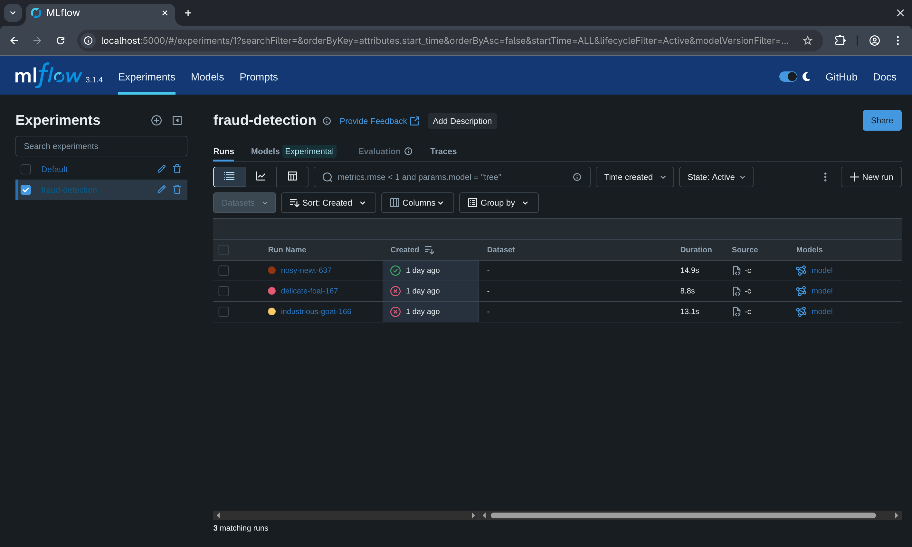

# 🧪 MLflow Setup

> Deploy the **MLflow Tracking Server + Model Registry** — experiment tracking, model versioning, and Staging→Production promotion for the fraud model. Replaces the legacy `ml_model_registry` Postgres table.

<table>
<tr><th>Component</th><th>Version</th><th>Helm Chart</th></tr>
<tr><td>MLflow</td><td><b>v3.1.4</b></td><td><code>community-charts/mlflow</code></td></tr>
<tr><td>Backend store</td><td>SQLite (PVC)</td><td>—</td></tr>
<tr><td>Artifact store</td><td>MinIO bucket <code>mlflow-artifacts</code></td><td>—</td></tr>
</table>

> [!NOTE]
> **Prerequisites:** Kind cluster running and MinIO deployed (see [airflow.md](airflow.md) step 4) — MLflow stores artifacts in MinIO.

---

## 🚀 Setup

### 1. Create the `mlflow-artifacts` bucket

```bash
kubectl port-forward svc/fraud-minio-console -n fraud-infra 9001:9001 &
# http://localhost:9001 (fraud_minio_user / fraud_minio_pass) → Buckets → Create → mlflow-artifacts
```

### 2. PVC for the SQLite backend

MLflow keeps metadata (experiments, runs, registry) in SQLite on a PVC so it survives pod restarts.

```bash
kubectl apply -f infra/k8s/mlflow-pvc.yaml
kubectl get pvc mlflow-sqlite-pvc -n fraud-infra   # Bound ... 5Gi
```

### 3. Deploy MLflow

```bash
helm repo add community-charts https://community-charts.github.io/helm-charts && helm repo update
helm install mlflow community-charts/mlflow --namespace fraud-infra --values infra/helm/mlflow/values.yaml
kubectl get pods -n fraud-infra | grep mlflow   # mlflow-xxx  1/1  Running
```

> [!NOTE]
> **Backend = SQLite on PVC** (no psycopg2). **Artifacts = MinIO** via `MLFLOW_S3_ENDPOINT_URL` → `fraud-minio.fraud-infra.svc.cluster.local:9000`, bucket `mlflow-artifacts`. In-cluster URL: `http://mlflow.fraud-infra.svc.cluster.local:5000`.

---

## 🔌 Wire pipelines to MLflow

Training/scoring jobs read MLflow via env (set in `dags/dag_ml_train.py` + `infra/helm/airflow/values.yaml`):

```bash
MLFLOW_TRACKING_URI=http://mlflow.fraud-infra.svc.cluster.local:5000
MLFLOW_S3_ENDPOINT_URL=http://fraud-minio.fraud-infra.svc.cluster.local:9000
AWS_ACCESS_KEY_ID=fraud_minio_user
AWS_SECRET_ACCESS_KEY=fraud_minio_pass
```

```yaml
# configs/pipeline_config.yaml
mlflow:
  tracking_uri: "http://mlflow.fraud-infra.svc.cluster.local:5000"
  experiment_name: "fraud-detection"
  model_name: "fraud-xgboost"
  artifact_bucket: "mlflow-artifacts"
```

> [!IMPORTANT]
> Any job that **loads** the Production model (batch scoring, inference) needs `AWS_*` + `MLFLOW_S3_ENDPOINT_URL` to pull artifacts from MinIO — boto3 only reads `AWS_`-prefixed creds, not `MINIO_*`.

---

## ✅ Verify

```bash
kubectl port-forward svc/mlflow -n fraud-infra 5000:5000   # http://localhost:5000

# after dag_ml_train runs once, the registered model should be in Production:
curl -s http://localhost:5000/api/2.0/mlflow/registered-models/search \
  | python3 -c "import sys,json;m=json.load(sys.stdin)['registered_models'][0]['latest_versions'][0];print(m['name'],m['version'],m['current_stage'])"
# fraud-xgboost 1 Production
```

Open **MLflow UI → Models → `fraud-xgboost`** → version 1 at stage **Production** (PR-AUC ≈ 0.8178).

<p align="center">
  
  <br/><em>MLflow Tracking — the <code>fraud-detection</code> experiment with logged training runs.</em>
</p>

---

## 🧹 Teardown

```bash
helm uninstall mlflow --namespace fraud-infra
kubectl delete pvc mlflow-sqlite-pvc -n fraud-infra
```
