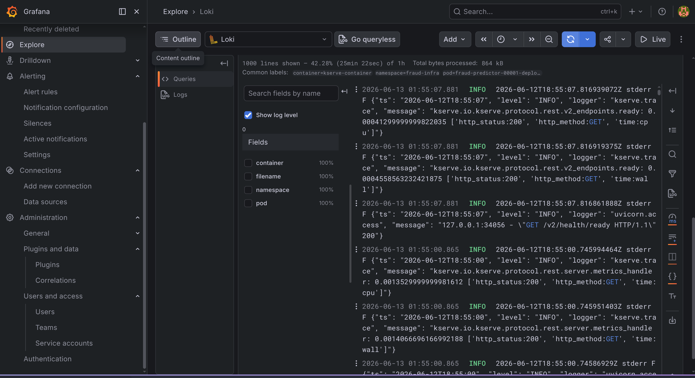

# 📊 Observability Setup

> The full observability stack for the platform — **metrics** (Prometheus + Grafana + Alertmanager), **logs** (Loki + Promtail), and **traces** (Jaeger). Pipeline metrics land in Pushgateway, the inference service is scraped via a ServiceMonitor, logs are queried with LogQL in Grafana, inference is traced span-by-span, and drift alerts route to Discord.

<table>
<tr><th>Component</th><th>Version</th><th>Helm Chart</th></tr>
<tr><td>Prometheus</td><td>3.4.0</td><td><code>prometheus-community/kube-prometheus-stack 85.2.0</code></td></tr>
<tr><td>Grafana</td><td>13.x</td><td>(subchart)</td></tr>
<tr><td>Alertmanager</td><td>0.32.x</td><td>(subchart)</td></tr>
<tr><td>Pushgateway</td><td>v1.10.0</td><td><code>infra/k8s/pushgateway.yaml</code></td></tr>
<tr><td>Loki</td><td>2.9.3</td><td><code>grafana/loki-stack</code></td></tr>
<tr><td>Promtail</td><td>bundled</td><td><code>grafana/loki-stack</code></td></tr>
<tr><td>Jaeger all-in-one</td><td>1.58</td><td><code>jaegertracing/jaeger</code></td></tr>
</table>

> [!NOTE]
> **Prerequisites:** `kubectl` + `helm`, a running Kind cluster. Metrics live in namespace `monitoring`; Jaeger lives in `fraud-infra` alongside the inference service.

---

## Part A — Metrics (Prometheus · Grafana · Alertmanager)

### 1. Namespace + repo

```bash
kubectl create namespace monitoring
helm repo add prometheus-community https://prometheus-community.github.io/helm-charts
helm repo update
```

### 2. Pushgateway — sink for short-lived batch-job metrics

```bash
kubectl apply -f infra/k8s/pushgateway.yaml
kubectl get pods -n monitoring -l app=pushgateway   # pushgateway-xxx  Running
```

### 3. kube-prometheus-stack

```bash
helm upgrade --install kube-prom prometheus-community/kube-prometheus-stack \
  --namespace monitoring --version 85.2.0 \
  -f infra/helm/monitoring/values.yaml --timeout 10m
```

Wait for all pods Running (~3 min for Grafana):

```
alertmanager-...-0                       2/2  Running
kube-prom-grafana-xxx                    3/3  Running
kube-prom-kube-prometheus-operator-xxx   1/1  Running
prometheus-...-0                         2/2  Running
pushgateway-xxx                          1/1  Running
```

### 4. Verify Prometheus targets

```bash
kubectl port-forward svc/kube-prom-kube-prometheus-prometheus -n monitoring 9090:9090
# http://localhost:9090 → Status → Targets
```

Scrape targets that should be **UP**: `airflow-statsd`, `minio`, `pushgateway`, and `fraud-inference-metrics` (appears after the ServiceMonitor is applied; it carries label `release: kube-prom`).

> [!NOTE]
> 4 targets report **down** on Kind — `kube-controller-manager`, `kube-etcd`, `kube-proxy`, `kube-scheduler` bind to `127.0.0.1` and aren't scrapable from a pod. This is expected.

### 5. Grafana dashboard

```bash
kubectl port-forward svc/kube-prom-grafana -n monitoring 3000:80
# http://localhost:3000  (admin / fraud-grafana-2025)
```

The `Fraud Detection — Overview` dashboard (auto-loaded from `infra/k8s/grafana-fraud-dashboard.yaml`) shows drift PSI, inference latency, and model quality:

<p align="center">
  
  <br/><em>Grafana — drift PSI per feature, inference p50/p95/p99 latency, and model PR-AUC/F1.</em>
</p>

### 6. Drift alerts → Discord

Drift alerting is **rule-based** (no code): the `fraud-drift-alerts` PrometheusRule fires on PSI thresholds and Alertmanager routes `category: drift` to Discord via native `discord_configs` (see `infra/k8s/fraud-drift-alerts.yaml`).

<p align="center">
  
  
  <br/><em>Feature-drift alert firing in Prometheus → delivered to Discord.</em>
</p>

> [!TIP]
> Update the stack values with:
> ```bash
> helm upgrade kube-prom prometheus-community/kube-prometheus-stack \
>   --namespace monitoring --version 85.2.0 \
>   -f infra/helm/monitoring/values.yaml --timeout 10m
> ```

---

## Part B — Logs (Loki + Promtail)

> Loki reuses the existing `kube-prom-grafana` as its UI, so the Grafana subchart is disabled — **Part A must be deployed first.**

### 1. Deploy Loki + Promtail

```bash
helm repo add grafana https://grafana.github.io/helm-charts && helm repo update
helm install loki grafana/loki-stack --namespace monitoring --values infra/helm/loki/values.yaml
```

```bash
kubectl get pods -n monitoring | grep -E "loki|promtail"
# loki-0              1/1  Running
# loki-promtail-xxx   1/1  Running   (DaemonSet)
```

> [!WARNING]
> **Knative appends the revision to the `app` label** — the predictor pod is `app=fraud-predictor-00001`, not `fraud-predictor`. So Promtail's `keep` relabel must match the prefix **`fraud-predictor.*`**; an exact match silently drops all inference logs (you'd only see `airflow` logs). Already fixed in `values.yaml`.

Confirm both namespaces are ingested:

```bash
kubectl run loki-q --rm -i --restart=Never --image=curlimages/curl -n monitoring -q -- \
  -s "http://loki.monitoring.svc.cluster.local:3100/loki/api/v1/label/namespace/values"
# {"status":"success","data":["airflow","fraud-infra"]}
```

### 2. Loki data source (auto-provision + the default-clash fix)

loki-stack auto-creates the Loki data source ConfigMap (`grafana_datasource=1`) — **but** marks it `isDefault: true`, which collides with Prometheus and crash-loops any new Grafana pod (*"Only one datasource per organization can be marked as default"*).

> [!IMPORTANT]
> loki-stack exposes no value to disable this. Patch the ConfigMap to `isDefault: false`, then restart Grafana. **This patch is overwritten by `helm upgrade loki`** — re-apply it after any upgrade.

```bash
kubectl patch configmap loki-loki-stack -n monitoring --type merge -p \
  '{"data":{"loki-stack-datasource.yaml":"apiVersion: 1\ndatasources:\n- name: Loki\n  type: loki\n  access: proxy\n  url: \"http://loki:3100\"\n  version: 1\n  isDefault: false\n  jsonData:\n    {}\n"}}'
kubectl rollout restart deployment/kube-prom-grafana -n monitoring
```

> [!TIP]
> Grafana has long probe delays (readiness 60s, liveness 180s) — wait ~2 min before judging a restart failed.

### 3. Query logs (LogQL)

Grafana → **Explore** → data source **Loki**:

```logql
{namespace="fraud-infra"} | json | level="INFO"      # inference server logs
{namespace="fraud-infra"} | json | fraud_score > 0.8 # high-risk predictions
{namespace="airflow"}     | json | level="ERROR"     # pipeline errors
```

Structured JSON logs expose `request_id`, `customer_id`, `fraud_score`, `latency_ms`, `n_instances`.

<p align="center">
  
  <br/><em>Inference & pipeline logs aggregated in Loki, queried via LogQL in Grafana Explore.</em>
</p>

---

## Part C — Traces (Jaeger)

> Distributed tracing of the inference service — per-step latency: `fetch_features` (DB lookup) vs `score_model` (XGBoost inference). The KServe custom model is instrumented with OpenTelemetry (OTLP gRPC exporter).

### 1. Deploy Jaeger

```bash
helm repo add jaegertracing https://jaegertracing.github.io/helm-charts && helm repo update
helm install jaeger jaegertracing/jaeger --namespace fraud-infra --values infra/helm/jaeger/values.yaml
kubectl get pods -n fraud-infra | grep jaeger   # jaeger-xxx  1/1  Running
```

> [!NOTE]
> **all-in-one** bundles collector + query + agent in one pod (no Cassandra/ES). Traces are kept in memory (max 50k, lost on restart — fine for dev). One service `jaeger` exposes **both** OTLP (`:4317`) and the UI/query API (`:16686`) — there is no separate `jaeger-collector`/`jaeger-query`.

### 2. Point inference at Jaeger

`infra/k8s/fraud-inference.yaml` already sets the OTLP endpoint:

```
OTEL_EXPORTER_OTLP_ENDPOINT=http://jaeger.fraud-infra.svc.cluster.local:4317
```

> [!TIP]
> The Jaeger **service name is `fraud-predictor`** (the server sets the OTel `Resource` service name = `MODEL_NAME`, not via `OTEL_SERVICE_NAME`). If the predictor started before Jaeger, the OTLP exporter retries — traces appear on the next request, no restart needed.

### 3. Verify

```bash
kubectl port-forward svc/jaeger -n fraud-infra 16686:16686
# http://localhost:16686 → Service: fraud-predictor → Find Traces
```

Or via the query API:

```bash
curl -s "http://jaeger.fraud-infra.svc.cluster.local:16686/api/services"
# {"data":["fraud-predictor"],...}
curl -s "http://jaeger.fraud-infra.svc.cluster.local:16686/api/traces?service=fraud-predictor&limit=5" \
  | python3 -c "import sys,json;d=json.load(sys.stdin)['data'];print('traces:',len(d));print(sorted({s['operationName'] for t in d for s in t['spans']}))"
# traces: 5
# ['fetch_features', 'score_model']
```

<p align="center">
  
  <br/><em>Jaeger trace — per-request breakdown of <code>fetch_features</code> (DB) vs <code>score_model</code> (XGBoost).</em>
</p>

---

## 🧹 Teardown

```bash
helm uninstall jaeger --namespace fraud-infra
helm uninstall loki --namespace monitoring
helm uninstall kube-prom --namespace monitoring
```
