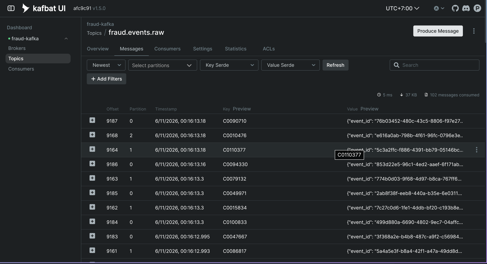

# 🔀 Streaming — Kafka + CDC + Spark Structured Streaming

> The streaming track ingests transactions the way a real fraud platform does:
> a product app writes to an **OLTP database**, **Debezium** captures the change
> log (CDC), **Kafka** carries it, and **Spark Structured Streaming** continuously
> lands it in the Delta Lake Bronze layer.

```
product app (generator)  →  Postgres oltp.transaction_events
        │  WAL (logical decoding, pgoutput)
        ▼
   Debezium (Kafka Connect)  →  Kafka topic  fraud.events.raw
        │  readStream
        ▼
   Spark Structured Streaming (fraud-spark-bronze, local[*], continuous)
        │  foreachBatch → exactly-once via checkpoint
        ▼
   Delta  s3://bronze/raw_fraud_events   (partition event_date)
        →  stream_silver → stream_features → … (unchanged)
```

This **replaces** the legacy 5-minute micro-batch consumer (`kafka_consumer.py` +
the old `stream_bronze` task). Downstream Silver, features, and training are
**unchanged** — they still read `stg_fraud_events` from the lakehouse.

<table>
<tr><th>Part</th><th>Component</th><th>Version</th><th>Manifest / code</th></tr>
<tr><td>Infra</td><td>Strimzi Operator</td><td>latest</td><td><code>strimzi.io/install/latest</code></td></tr>
<tr><td>Infra</td><td>Kafka (KRaft)</td><td>4.1.0</td><td><code>infra/k8s/kafka/kafka.yaml</code>, <code>kafka-topics.yaml</code></td></tr>
<tr><td>B</td><td>OLTP source</td><td>—</td><td><code>src/pipelines/oltp/ddl.py</code>, <code>src/generator/streaming/oltp_writer.py</code></td></tr>
<tr><td>B</td><td>Debezium (Postgres)</td><td>3.5.2.Final</td><td><code>infra/k8s/kafka/kafka-connect.yaml</code> + <code>debezium-connector.yaml</code></td></tr>
<tr><td>A</td><td>Spark Structured Streaming</td><td>3.5.3</td><td><code>src/pipelines/streaming/spark_bronze.py</code>, <code>infra/k8s/spark-streaming.yaml</code></td></tr>
</table>

> [!NOTE]
> **Prerequisites:** Kind cluster running, namespace `fraud-infra` created, and
> MinIO + PostgreSQL deployed — see [airflow.md](airflow.md).

---

## 1. Kafka cluster (Strimzi, KRaft)

### 1.1 Strimzi operator

```bash
kubectl create -f 'https://strimzi.io/install/latest?namespace=fraud-infra' -n fraud-infra
kubectl get pods -n fraud-infra | grep strimzi   # strimzi-cluster-operator-xxx  Running
```

### 1.2 Deploy the Kafka cluster

```bash
kubectl apply -f infra/k8s/kafka/kafka.yaml
kubectl wait kafka/fraud-kafka -n fraud-infra --for=condition=Ready --timeout=300s
```

> [!NOTE]
> **KRaft mode** (no Zookeeper): pod `fraud-kafka-fraud-pool-0` is both controller + broker.
> In-cluster bootstrap: `fraud-kafka-kafka-bootstrap.fraud-infra.svc.cluster.local:9092`.

### 1.3 Create the topic

```bash
kubectl apply -f infra/k8s/kafka/kafka-topics.yaml
kubectl get kafkatopic -n fraud-infra
# fraud-events-raw   fraud-kafka   3   1   True
```

> [!TIP]
> The `KafkaTopic` CR is named `fraud-events-raw` but the real Kafka topic is
> **`fraud.events.raw`** (`spec.topicName`) — the same topic Debezium routes to
> and Spark subscribes to (`configs/pipeline_config.yaml` → `kafka.topic_fraud_events`).

<p align="center">
  
  <br/><em>Strimzi Kafka cluster + <code>fraud.events.raw</code> topic Ready.</em>
</p>

---

## Part B — CDC source (Postgres → Debezium → Kafka)

### 2. Enable logical replication on Postgres

Debezium decodes the WAL, which requires `wal_level=logical`.

**Fresh install** — deploy Postgres with the CDC values (`wal_level`, replication slots, and a `REPLICATION` grant for the app user run via `initdb`):

```bash
helm upgrade --install fraud-postgres bitnami/postgresql \
  --namespace fraud-infra -f infra/helm/postgres/values.yaml
```

**Existing install** (data already on the PVC — `initdb` won't re-run) — apply it live and restart:

```bash
SU=$(kubectl get secret fraud-postgres-postgresql -n fraud-infra -o jsonpath='{.data.postgres-password}' | base64 -d)
kubectl exec -i -n fraud-infra fraud-postgres-postgresql-0 -- bash -c "PGPASSWORD=$SU psql -U postgres -d fraud_detection" <<'SQL'
ALTER SYSTEM SET wal_level = logical;
ALTER SYSTEM SET max_wal_senders = 10;
ALTER SYSTEM SET max_replication_slots = 10;
ALTER ROLE fraud_user WITH REPLICATION;
SQL
kubectl rollout restart statefulset/fraud-postgres-postgresql -n fraud-infra   # wal_level needs a restart
```

```bash
# verify both ways:
kubectl exec -n fraud-infra fraud-postgres-postgresql-0 -- \
  env PGPASSWORD=fraud_pass psql -U fraud_user -d fraud_detection \
  -tAc "SHOW wal_level; SELECT rolreplication FROM pg_roles WHERE rolname='fraud_user';"   # → logical / t
```

### 3. Create the OLTP table + CDC publication

The setup script uses the in-cluster service DNS by default — run it from a laptop over a port-forward with `POSTGRES_HOST`/`POSTGRES_PORT` overrides:

```bash
kubectl port-forward svc/fraud-postgres-postgresql -n fraud-infra 15432:5432 &
POSTGRES_HOST=127.0.0.1 POSTGRES_PORT=15432 \
  .venv/bin/python scripts/setup/init_oltp_schema.py     # oltp.transaction_events + dbz_fraud_publication
```

> [!NOTE]
> The table's primary key is **`(event_id, event_timestamp)`** — the dedup key,
> identical to Silver `clean_events`. A mobile retry (same `event_id`, new
> timestamp) is kept as a distinct row; an exact re-insert is dropped.

### 4. Build & deploy Kafka Connect with the Debezium plugin

The Connect image (Debezium plugin baked in) is built + pushed manually — like the airflow/inference images — so there is **no in-cluster build and no push secret**. The base tag must match the running Strimzi operator (see the Dockerfile comment).

```bash
docker build -f infra/docker/kafka-connect/Dockerfile -t ancaotrinh/fraud-kafka-connect:latest .
docker push ancaotrinh/fraud-kafka-connect:latest

kubectl apply -f infra/k8s/kafka/kafka-connect.yaml
kubectl wait --for=condition=Ready kafkaconnect/fraud-connect -n fraud-infra --timeout=600s
```

### 5. Start the Debezium connector

```bash
kubectl apply -f infra/k8s/kafka/debezium-connector.yaml
kubectl get kafkaconnector fraud-oltp-connector -n fraud-infra   # READY=True
```

> [!IMPORTANT]
> The connector emits a **flat row** to `fraud.events.raw` (not the Debezium
> envelope): the worker uses `JsonConverter` with `schemas.enable=false`, the
> `unwrap` SMT (`ExtractNewRecordState`) drops the `{before,after,op}` wrapper,
> and the `route` SMT renames `fraud.oltp.transaction_events` → `fraud.events.raw`.
> So the message shape is identical to the legacy event — Spark/Silver need no change.

### 6. Feed the OLTP table (the "product app")

The generator writes events into OLTP; Debezium streams them out. Run it from a laptop over the same port-forward (`POSTGRES_HOST`/`POSTGRES_PORT` overrides):

```bash
kubectl port-forward svc/fraud-postgres-postgresql -n fraud-infra 15432:5432 &
POSTGRES_HOST=127.0.0.1 POSTGRES_PORT=15432 \
  .venv/bin/python -m src.generator.streaming.oltp_writer replay \
  --source data/raw/streaming/fraud_events.json --speed 3600 --max-events 200000
```

Inserts are idempotent on the dedup key (`ON CONFLICT (event_id, event_timestamp) DO NOTHING`), so a re-run is safe. Use `--speed 0` for a fast bulk load (no pacing).

---

## Part A — Spark Structured Streaming → Bronze

### 7. Build & push the Spark image (jars baked in)

```bash
docker build -f infra/docker/spark/Dockerfile -t ancaotrinh/fraud-spark:latest .
docker push ancaotrinh/fraud-spark:latest
```

The image bakes the connector jars (delta-spark, spark-sql-kafka, hadoop-aws) so there is **no runtime `--packages` download** on Kind.

### 8. Deploy the streaming job

```bash
kubectl apply -f infra/k8s/fraud-pipeline-secret.yaml      # MinIO creds (if not applied)
kubectl apply -f infra/k8s/spark-streaming.yaml
kubectl logs -n fraud-infra deploy/fraud-spark-bronze -f   # watch "batch N: appended …"
```

> [!NOTE]
> Runs the driver in `local[*]` mode as a **single pod** — light enough for a
> single-node Kind cluster, no Spark cluster/operator needed. `replicas: 1` +
> `strategy: Recreate` guarantee only one driver ever owns the checkpoint
> (which holds the Kafka offsets → **exactly-once** into Delta).

> [!WARNING]
> **Cutover:** Spark becomes the sole writer of `s3://bronze/raw_fraud_events`.
> Spark writes the timestamp columns as `timestamp_ntz` to match the existing
> table written by the legacy delta-rs consumer. If the table has an incompatible
> schema, clear it once before first run: `mc rm -r --force <alias>/bronze/raw_fraud_events`
> (and the `_checkpoints/` path).

---

## ✅ Verify the end-to-end stream

```bash
# 1. rows landing in OLTP
kubectl exec -n fraud-infra fraud-postgres-postgresql-0 -- \
  env PGPASSWORD=fraud_pass psql -U fraud_user -d fraud_detection \
  -c "SELECT count(*) FROM oltp.transaction_events;"

# 2. messages on Kafka
kubectl exec -n fraud-infra fraud-kafka-fraud-pool-0 -- bin/kafka-console-consumer.sh \
  --bootstrap-server localhost:9092 --topic fraud.events.raw --max-messages 3

# 3. Bronze growing (Spark)
kubectl logs -n fraud-infra deploy/fraud-spark-bronze --tail=20
```

The Airflow `stream_bronze` DAG no longer ingests — it now runs every 10 min as a
**freshness monitor**, failing (→ alert) if `max(ingest_ts)` on Bronze exceeds
`sla.bronze_freshness_min`, i.e. if the Spark/Debezium stream has stalled.

---

## 🧹 Teardown

```bash
# streaming + CDC
kubectl delete -f infra/k8s/spark-streaming.yaml
kubectl delete -f infra/k8s/kafka/debezium-connector.yaml
kubectl delete -f infra/k8s/kafka/kafka-connect.yaml
.venv/bin/python scripts/setup/init_oltp_schema.py --drop

# Kafka cluster + operator
kubectl delete -f infra/k8s/kafka/kafka-topics.yaml
kubectl delete -f infra/k8s/kafka/kafka.yaml
kubectl delete -f 'https://strimzi.io/install/latest?namespace=fraud-infra' -n fraud-infra
```
